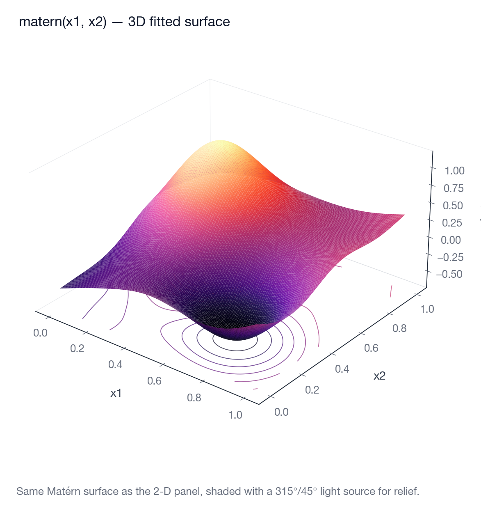

# gam &middot; gamfit

[](https://pypi.org/project/gamfit/)
[](https://pypi.org/project/gamfit/)
[](https://gamfit.readthedocs.io/)
[](https://github.com/SauersML/gam/actions/workflows/test.yml)
[](LICENSE)

A formula-first generalized additive model engine. Written in Rust,
with a Python library on top.

Fits Gaussian, binomial, Poisson, and Gamma GLMs with smooth terms,
random effects, bounded/constrained coefficients, location-scale
extensions, survival likelihoods, and flexible/learnable link functions.
Smoothing parameters are selected by REML or LAML. Posterior sampling
uses NUTS where supported, with a Gaussian Laplace fallback for model
classes that don't yet have an exact NUTS path.

**Docs:** <https://gamfit.readthedocs.io/> &middot; **PyPI:**
<https://pypi.org/project/gamfit/>



## Two ways to use it

```python
# Python library (gamfit)
import gamfit
model = gamfit.fit(train, "y ~ s(x) + group(site)")
preds = model.predict(test, interval=0.95)
```

```bash
# Rust CLI (gam)
gam fit data.csv 'y ~ smooth(x) + group(site)' --out model.json
gam predict model.json new_data.csv --uncertainty
gam report model.json data.csv
```

Both share one engine, one formula DSL, and one on-disk format. Train
in the CLI and score in Python, or vice versa.

## Install

**Python.** Wheels for Linux (x86_64, aarch64), macOS (Intel + Apple
silicon), and Windows. No Rust toolchain required.

```bash
uv add gamfit
# or
pip install gamfit
```

Optional extras: `gamfit[pandas]`, `gamfit[plot]`, `gamfit[sklearn]`,
`gamfit[all]`.

**Rust CLI.** One-liner installer for macOS, Linux, and Windows Git Bash:

```bash
curl -fsSL https://raw.githubusercontent.com/SauersML/gam/main/install.sh | bash
```

Or build from source: `cargo build --release` — the binary lands at
`./target/release/gam`.

## What makes it different

Features that other GAM libraries don't combine in one place.

### Three-part penalty structure

Each smooth gets independent penalties on **magnitude, gradient, and
curvature**. Most libraries use one (curvature only) or two. Keeping
them separate penalizes a flat-but-offset function differently from a
wiggly one.

```python
gamfit.fit(df, "z ~ duchon(pc1, pc2, pc3, pc4, centers=50)")
```

### Adaptive per-axis anisotropy

Surface smooths learn how much to shrink each axis independently, so
`(latitude, age, log_income)` doesn't share a single length-scale.

```python
gamfit.fit(df, "z ~ matern(pc1, pc2, pc3, pc4)", scale_dimensions=True)
```

### Surface smooths in arbitrary dimension

P-spline, thin-plate, Matérn, and **Duchon** radial bases. Duchon uses
triple-operator regularization (mass + tension + stiffness) and is
scale-free by default. Kernels and scaling regimes can be mixed.

```python
gamfit.fit(df, "y ~ matern(x1, x2, x3, nu=5/2)")
gamfit.fit(df, "y ~ duchon(x1, x2, x3, x4, centers=80)")
gamfit.fit(df, "y ~ te(space, time, k=10)")   # tensor product
```

### Geometric / manifold smooths

When the predictor space is a circle, cylinder, torus, sphere, or
Möbius strip, ordinary smooths produce visible seams and pole
artefacts. gamfit's geometric smooths bake the wrap topology into
both the basis and the penalty — `periodic=[axes]`, `period=[...]`
margins for tensor products, an intrinsic `sphere(...)` kernel
(Wahba's reproducing kernel or spherical harmonics), and
boundary-conditioned 1-D B-splines.


Each pair shows a noisy 3-D point cloud (left) and the smooth
manifold the geometric smooths recover (right). The full gallery,
formulas, and reproduction script live in
[docs/manifold-smooths.md](docs/manifold-smooths.md).

```python
gamfit.fit(df, "y ~ s(theta, periodic=true, period=6.283)")        # circle
gamfit.fit(df, "y ~ te(theta, h, periodic=[0], period=[6.283, None])")  # cylinder
gamfit.fit(df, "y ~ te(u, v, periodic=[0,1], period=[6.283, 6.283])")   # torus
gamfit.fit(df, "y ~ sphere(lat, lon, radians=true)")               # S²
gamfit.fit(df, "y ~ s(x, bc=clamped)")                             # zero-slope endpoints
```

### Flexible / learnable link functions

A spline offset on top of a base link lets the data correct for link
misspecification. `blended(logit, probit)` learns a mixture; `sas` and
`beta-logistic` learn shape parameters from the data.

```python
gamfit.fit(df, "case ~ s(age) + link(type=flexible(probit))"
                 " + linkwiggle(internal_knots=6)")
```

### Marginal-slope models

For binary or survival outcomes with a calibrated risk score (e.g. a
polygenic score), put **baseline risk** and **score effect** in
separate formulas. The slope on the score is a smooth function of
covariate space, so the baseline can't absorb signal that belongs to
it.

```python
gamfit.fit(
    df,
    "case ~ matern(pc1, pc2, pc3)",
    family="bernoulli-marginal-slope",
    link="probit",
    z_column="pgs_z",
    logslope_formula="matern(pc1, pc2, pc3)",
)
```


Two predicted-probability surfaces over the same `(pc1, pc2)` plane —
one at `z = 0`, one at `z = +2`. The vertical gap between them is the
spatially-varying score effect.

### Survival with on-demand surfaces

`Surv(entry, exit, event)` + four likelihood modes (transformation,
Weibull, location-scale, marginal-slope) + a `SurvivalPrediction`
object that evaluates `S(t)`, `h(t)`, `H(t)` on any time grid:

```python
pred = model.predict(test_df)
S = pred.survival_at([1, 5, 10, 20])     # (n_rows, 4)
H = pred.cumulative_hazard_at([10])      # (n_rows, 1)
```

For population-scale cohorts, stream to CSV without materialising the
full matrix: `pred.write_survival_at_csv("surv.csv", times=[...])`.

### NUTS posteriors

`model.sample(...)` runs the No-U-Turn Sampler over the coefficient
posterior conditional on the fitted smoothing parameters. Predictive
bands stream in row chunks, so memory stays bounded on large test
sets.

```python
posterior = model.sample(train, seed=42)
bands = posterior.predict(test, level=0.95)
# eta_mean, eta_lower, eta_upper, mean, mean_lower, mean_upper
```

### Bounded coefficients with informative priors

Hard interval transforms with optional Beta priors, for proportions,
mixing weights, or any coefficient that must live in `[a, b]`:

```python
gamfit.fit(df,
    "y ~ age + bounded(prop, min=0, max=1, target=0.5, strength=3)")
```

### scikit-learn drop-in

```python
from gamfit.sklearn import GAMRegressor
est = GAMRegressor(formula="y ~ s(x)").fit(X, y)
```

## Where to learn more

- **Python documentation:** <https://gamfit.readthedocs.io/> — getting
  started, the formula DSL, families and links, survival,
  marginal-slope, posterior sampling, scikit-learn integration, a
  runnable cookbook, and an auto-generated API reference.
- **CLI help:** `gam <command> --help` (commands: `fit`, `predict`,
  `report`, `diagnose`, `sample`, `generate`).
- **Cookbook:** [docs/cookbook.md](docs/cookbook.md).
- **Manifold smooths gallery:** [docs/manifold-smooths.md](docs/manifold-smooths.md)
  — visual tour of the periodic / sphere / cylinder / torus / Möbius /
  BC smooths, recovered from noisy 3-D point clouds.

## Repository layout

| Path | Contents |
| --- | --- |
| `src/` | Rust engine: fitting, inference, smooth construction, survival, CLI. |
| `crates/gam-pyffi/` | PyO3 bindings (the `gamfit._rust` native extension). |
| `gamfit/` | Pure-Python public API on top of the bindings. |
| `docs/` | MkDocs/Material documentation sources (built to RTD). |
| `tests/` | Rust + Python integration tests. |
| `bench/` | Benchmark harness, scenario configs, datasets, plots. |
| `scripts/` | Runnable demo / diagnostic / utility scripts (the manifold smooths gallery lives here). |

## Development

```bash
# Rust
cargo fmt --all
cargo clippy --all-targets --all-features -- -A warnings -D clippy::correctness -D clippy::suspicious
cargo test --all-features

# Python docs (uses uv)
uv venv --python 3.12 .venv-docs
uv pip install --python .venv-docs/bin/python -r docs/requirements.txt
.venv-docs/bin/mkdocs serve
```

Benchmark suite: `python3 bench/run_suite.py --help`.

## Issues, feedback, contributions

Open a [GitHub issue](https://github.com/SauersML/gam/issues) for bug
reports, feature requests, or questions — including "this doesn't
work the way I expect."

## License

AGPL-3.0-or-later. See [LICENSE](LICENSE).
