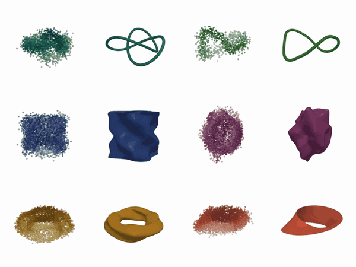
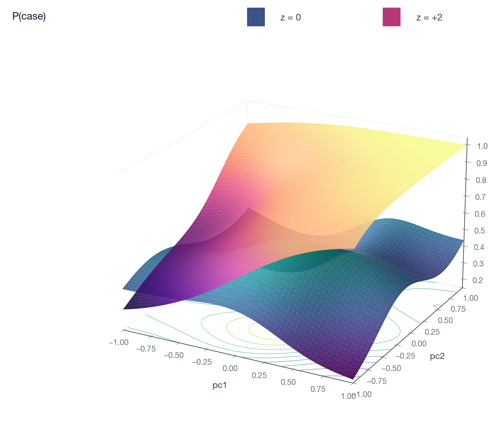

# gam / gamfit

[](https://pypi.org/project/gamfit/)
[](https://pypi.org/project/gamfit/)
[](https://gamfit.readthedocs.io/)
[](https://github.com/SauersML/gam/actions/workflows/test.yml)
[](LICENSE)

A generalized additive model engine. The fitting code is in Rust. The
public interfaces are a Rust CLI (`gam`) and a Python package
(`gamfit`). Both share one engine, one formula DSL, and one on-disk
model format.

Docs: <https://gamfit.readthedocs.io/>. PyPI: <https://pypi.org/project/gamfit/>.


## Scope

Supported response families: Gaussian, binomial / Bernoulli (including a
marginal-slope variant for calibrated risk scores), Poisson, Gamma, and
parametric / semi-parametric survival.

Supported term types in formulas: parametric terms, univariate smooths
(`s`), tensor-product smooths (`te`, `ti`), radial smooths in arbitrary
dimension (`matern`, `duchon`, `thinplate`), intrinsic sphere smooths
(`sphere`), random effects (`group`), interval-bounded coefficients
(`bounded`), and learnable links (`link(type=flexible(...))`,
`link(type=blended(...))`, `sas`, `beta-logistic`, `linkwiggle`).

Smoothing parameters are selected by REML or LAML. Posterior sampling
uses NUTS over the coefficient posterior conditional on the fitted
smoothing parameters where the family supports it, and a Gaussian
Laplace approximation otherwise.

## Install

Python wheels are published for Linux (x86_64, aarch64), macOS (Intel
and Apple silicon), and Windows. A Rust toolchain is not required.

```bash
uv add gamfit
# or
pip install gamfit
```

Optional extras: `gamfit[pandas]`, `gamfit[plot]`, `gamfit[sklearn]`,
`gamfit[torch]`, `gamfit[all]`.

For the Rust CLI:

```bash
curl -fsSL https://raw.githubusercontent.com/SauersML/gam/main/install.sh | bash
```

Or `cargo build --release`. The binary is `./target/release/gam`.

## Usage

Python:

```python
import gamfit
model = gamfit.fit(train, "y ~ s(x) + group(site)")
preds = model.predict(test, interval=0.95)
```

CLI:

```bash
gam fit data.csv 'y ~ smooth(x) + group(site)' --out model.json
gam predict model.json new_data.csv --uncertainty
gam report model.json data.csv
```

CLI subcommands: `fit`, `predict`, `report`, `diagnose`, `sample`,
`generate`. Run `gam <command> --help` for options.

## Examples

Surface smooths in arbitrary dimension, with optional per-axis length
scales:

```python
gamfit.fit(df, "y ~ matern(x1, x2, x3, nu=5/2)")
gamfit.fit(df, "y ~ duchon(x1, x2, x3, x4, centers=80)")
gamfit.fit(df, "y ~ te(space, time, k=10)")
gamfit.fit(df, "z ~ matern(pc1, pc2, pc3, pc4)", scale_dimensions=True)
```

Smooths on manifolds. The basis and penalty encode the wrap topology,
so a fit on `theta ∈ [0, 2π)` has no seam at 0 / 2π, and an `S²` fit
has no pole artefacts. The Möbius example in the gallery below is a
4π-periodic double-cover parameterization of a Möbius embedding; the
predictor basis is not itself twisted.

```python
gamfit.fit(df, "y ~ s(theta, periodic=true, period=2*pi)")
gamfit.fit(df, "y ~ te(theta, h, periodic=[0], period=[2*pi, None])")
gamfit.fit(df, "y ~ te(u, v, periodic=[0,1], period=[2*pi, 2*pi])")
gamfit.fit(df, "y ~ sphere(lat, lon, radians=true)")
gamfit.fit(df, "y ~ s(x, bc=clamped)")
```



Each pair shows the noisy input (left) and the recovered smooth
(right). The full gallery and reproduction script:
[docs/manifold-smooths.md](docs/manifold-smooths.md).

Learnable link functions. A `flexible(base)` link adds a spline offset
on top of a base link. `blended(l1, l2)` learns a mixture weight. `sas`
and `beta-logistic` learn shape parameters.

```python
gamfit.fit(df, "case ~ s(age) + link(type=flexible(probit))"
                 " + linkwiggle(internal_knots=6)")
```

Marginal-slope models for binary or survival outcomes with a calibrated
risk score. The baseline and the score effect are fit in separate
formulas; the score effect is a smooth function of covariate space.

```python
gamfit.fit(
    df,
    "case ~ matern(pc1, pc2, pc3)",
    family="bernoulli-marginal-slope",
    link="probit",
    z_column="pgs_z",
    logslope_formula="matern(pc1, pc2, pc3)",
)
```



Survival models. `Surv(entry, exit, event)` is supported in four
likelihood modes: transformation, Weibull, location-scale, and
marginal-slope. `model.predict(...)` returns a `SurvivalPrediction`
with on-demand `S(t)`, `h(t)`, `H(t)` on any time grid:

```python
pred = model.predict(test_df)
S = pred.survival_at([1, 5, 10, 20])
H = pred.cumulative_hazard_at([10])
pred.write_survival_at_csv("surv.csv", times=[...])  # streamed
```

Posterior sampling. `model.sample(...)` draws from the coefficient
posterior conditional on the fitted smoothing parameters. Predictive
bands are computed in row chunks.

```python
posterior = model.sample(train, seed=42)
bands = posterior.predict(test, level=0.95)
```

Interval-bounded coefficients with an optional Beta prior:

```python
gamfit.fit(df,
    "y ~ age + bounded(prop, min=0, max=1, target=0.5, strength=3)")
```

scikit-learn wrappers:

```python
from gamfit.sklearn import GAMRegressor
est = GAMRegressor(formula="y ~ s(x)").fit(X, y)
```

## Penalties

A smooth term contributes one or more penalized coefficient blocks,
each with its own smoothing parameter selected by REML/LAML. For
polyharmonic and Duchon radial bases, three penalty operators act on
the same coefficient block: a magnitude operator, a gradient operator,
and a curvature operator. P-spline, thin-plate, and tensor-product
smooths use their standard derivative-based penalties.

## GPU

The Rust engine includes optional CUDA support (cuBLAS, cuSOLVER,
cuSPARSE). It loads lazily and falls back to the CPU path when no
working CUDA stack is found. The same wheel runs on CPU-only and GPU
hosts.

Per-op dispatch thresholds are measured at probe time from GPU FP64
throughput, CPU FP64 throughput, and PCIe bandwidth. Below the
crossover where transfer cost dominates, kernels stay on the CPU. To
print the calibrated thresholds:

```python
import gamfit
print(gamfit.format_cuda_diagnostics())
```

If both a system CUDA toolkit and PyTorch's `nvidia-*-cu12` wheels are
present in the same environment, the same SONAME (e.g.
`libcublas.so.12`) can appear twice in `/proc/self/maps`. This is
benign when glibc resolves `dlopen(SONAME)` to a single file; gamfit
warns once per conflict-set and continues. The pathological case
(`cublasDestroy_v2` aborting in glibc) only occurs if calling code
`dlopen`s both files by absolute path. Keep one CUDA toolkit
reachable.

If you use gamfit together with `torch` and your driver is CUDA 12.x,
install a torch build whose CUDA suffix matches the driver
(`+cu12x`). gamfit itself loads cuBLAS / cuSOLVER / cuSPARSE through
whichever `libcudart.so.12` is reachable.

## Repository layout

| Path | Contents |
| --- | --- |
| `src/` | Rust engine: fitting, inference, smooth construction, survival, CLI. |
| `crates/gam-pyffi/` | PyO3 bindings (`gamfit._rust`). |
| `gamfit/` | Python public API on top of the bindings. |
| `docs/` | MkDocs/Material documentation sources. |
| `tests/` | Rust and Python integration tests. |
| `bench/` | Benchmark harness, configs, datasets, plots. |
| `scripts/` | Demo and diagnostic scripts, including the manifold smooths gallery. |

## Development

```bash
cargo fmt --all
cargo clippy --all-targets --all-features -- -A warnings -D clippy::correctness -D clippy::suspicious
cargo test --all-features

uv venv --python 3.12 .venv-docs
uv pip install --python .venv-docs/bin/python -r docs/requirements.txt
.venv-docs/bin/mkdocs serve
```

Benchmarks: `python3 bench/run_suite.py --help`.

## Documentation

- Full Python documentation: <https://gamfit.readthedocs.io/>.
- Cookbook: [docs/cookbook.md](docs/cookbook.md).
- Manifold smooths gallery: [docs/manifold-smooths.md](docs/manifold-smooths.md).

## Issues

Open a [GitHub issue](https://github.com/SauersML/gam/issues) for bug
reports, feature requests, or questions.

## License

AGPL-3.0-or-later. See [LICENSE](LICENSE).
