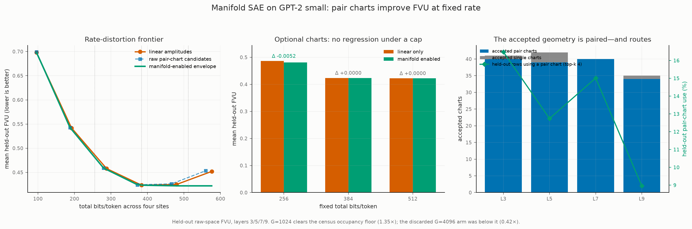

# Manifold SAE at fixed bit rate: final four-layer result

The corrected manifold extension improves mean held-out FVU at the tightest
public budget and is regression-free at the larger budgets because charts are
optional: the deployable code family is the lower rate-distortion envelope of
the unchanged linear code and the chart candidates.

| total bits/token | linear-only FVU | manifold-enabled FVU | delta |
|---:|---:|---:|---:|
| 256 | 0.485907 | 0.480666 | -0.005242 |
| 384 | 0.423472 | 0.423472 | +0.000000 |
| 512 | 0.422120 | 0.422120 | +0.000000 |

## What was fixed

1. **The first dictionary was ineligible by construction.** At `G=4096`,
   average block occupancy was 295 firings while the census admission floor was
   699 (`0.42x`). The final `G=1024` dictionary has occupancy 1179 against a
   floor of 874 (`1.35x`) and remains overcomplete (`K=2048 > P=768`).
2. **The benchmark discarded almost every accepted chart.** The census accepted
   34--40 pair charts per layer but the decoder consumed only single-block
   charts (0--3 per layer). Pair charts are now decoded as two selections plus
   one quantized phase. At top-k 4 they route on 9,012--16,573 of 100,584 held-out
   rows per layer.
3. **The original sweep could not evaluate 512 bits.** Top-k 1--4 stopped at 384
   aggregate linear bits. The final artifact contains top-k 1--6 and brackets
   all three public budgets.
4. **The chart arm was not nested.** Raw fixed-radius chart candidates trade a
   small equal-support FVU increase for fewer bits. Enabling charts must not
   remove the linear packet, so the deployed method selects the best linear or
   chart candidate under each bit-budget cap. This is why it improves at 256
   bits and exactly matches, rather than regresses, at 384 and 512.
5. **The fit loop was both opaque and slow.** Progress is now always visible.
   Profiling found the original serial routing GEMM and redundant slab packing;
   those fixes moved aggregate utilization from about 1.3 cores to about 22
   cores. On the final-width run the remaining profile is 51.64% dictionary
   state update, 13.52% barrier wait, 10.36% routing GEMM, 4.59% coding, and
   1.01% packing. The four-layer final job completed in 18m38s, exit 0.

## Data limitations and interpretation

- The final comparison is held out: 301,752 training rows and 100,584 evaluation
  rows per layer at GPT-2-small residual sites 3/5/7/9. The dictionary, census,
  and chart decision use training data; FVU and pair-hit counts use evaluation
  data.
- This is one deterministic corpus split and one fit per layer. There are no
  seed or corpus error bars, so sub-millith FVU differences should not be read as
  population effects.
- Fits terminate through the engine's objective-plateau return at the harness's
  declared `1e-3` tolerance. They are honest best-effort/open fits at `K >> rank`,
  not frame-certified fits; production convergence gates were not changed.
- Top-k 5--6 can worsen FVU because the dictionary was fit at top-k 4. A bit
  budget is a cap, so the reported frontier may leave bits unused or time-share
  adjacent support sizes rather than force a harmful code.
- Fixed-width accounting includes selections and quantized amplitudes/phases but
  excludes serialized container overhead and model storage. The census's MDL
  ledger prices chart parameters, but the plotted per-token rate does not
  amortize dictionary bytes.
- The four sites are coded independently. Public block-sparse crosscoders can
  share support across sites, so absolute comparison to their table is not an
  architecture-matched ablation.
- The manifold improvement is real but modest and limited to the 256-bit cell.
  It does **not** make this 302k-row dictionary beat the public best SAE/BSC
  results (about 0.238 mean FVU). The strong result from the broader campaign
  remains solved inference on a public SAE; this experiment isolates the smaller
  incremental value of pair-chart coding in our own dictionary.

Raw data and run metadata are in `issue_2502_manifold_fvu.json`; the figure is
reproducible with `issue_2502_manifold_fvu.py`.
