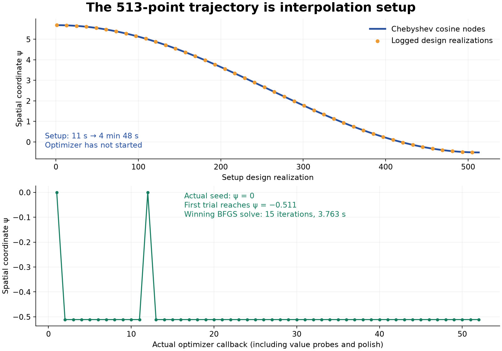
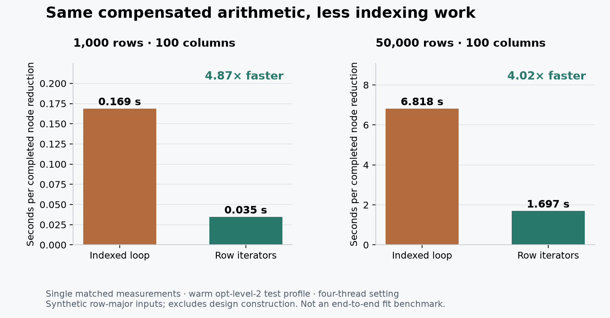

# Spatial interpolation setup (#2827)

The 518 design realizations reported in [#2827](https://github.com/SauersML/gam/issues/2827)
are 513 fixed Chebyshev interpolation nodes, three off-node checks, one seed
re-realization, and one exact-polish re-realization. The expensive phase precedes
the optimization.

`setup_vs_optimizer.csv` extracts the two phases from the retained `psilog.log`
trace of the Gaussian 50,000-row, six-dimensional, 100-center Duchon fixture.
Source trace SHA-256: `fb1a9b408cccc0de045968186b183d6dafe5c777f6e2af549a6802005f272edc`.
The first 513 logged coordinates fit the source's cosine-node formula with a
maximum residual of 5.33e-7 in the six-decimal stage output. The fitted window is
approximately [-0.511102708, 5.686759129].

The actual optimizer starts at psi=0 and its first trial reaches psi=-0.5111.
The winning BFGS solve takes 15 iterations and 3.763 seconds. In this trace,
interpolation setup occupies approximately 277 seconds, from the first design
realization at 11 seconds to attachment at 4 minutes 48 seconds. These are
measurements from the original trace, not timings of the adaptive repair.



Reproduce the extraction and plot with NumPy and Matplotlib:

```sh
python plot.py INPUT.log setup_vs_optimizer.png setup_vs_optimizer.csv
```

The adaptive repair uses nested Lobatto nodes and retains only exact Gram/RHS
samples. It requires coefficient tails to reach their floating-point
accumulation floor and checks both statistics against exact off-node rebuilds.
The 16 tensor tests pass, including analytic derivative, ridge-penalized solve,
profile curvature, nonanalytic refusal, sample reuse, and finite-statistic
certification checks. Non-finite weighted inputs, statistics, normalization,
coefficients, and reconstructed spot values are refused; signed responses and
finite zero statistics remain valid. The exact-power
test uses 33 node realizations plus three checks, compared with the original
513 plus three.

The production standardized-Duchon integration gate (600 rows, 11 columns)
certifies at 129 nodes plus three checks: 132 design realizations instead of
516. Tensor construction takes 1.799842 seconds; the complete test takes 2.53
seconds. Its unchanged coefficient checks against an independently streamed
solve pass with zero error. Both moved probes rotate the reduced basis, so the
existing projector witness requires exact streamed evaluation there. This
checks preservation of that routing safeguard; it does not measure tensor
approximation error on an admitted moved-coordinate fast path.

The original 50,000-row fixture's repaired fit time and objective remain
unverified. These smaller gates are not an end-to-end reproduction of it.

The 16-test finite-guard source `psi_gram_tensor.rs` Git blob is
`6043c2ee4f8d9ca811feb504593e495e83cd78f2`.
The 600-row integration measurement used the preceding adaptive source blob
`3f9a9494131c13ce568f4329c902355ee3bb2480`, before the explicit finite-value guards.

## Compensated reduction cost

The node reduction retains its compensated row summation but traverses the
upper Gram rows with iterators instead of repeatedly indexing two-dimensional
arrays. All 17 tensor tests pass. The added comparison against the historical
indexed recurrence is bit-identical for row-major, column-major, and reversed
layouts; the earlier value and derivative measurements are unchanged.



`reduction_bench.csv` records single bounded measurements with the same warmed
opt-level-2 test profile and four-thread setting. The deterministic synthetic
matrix has 100 columns. One 50,000-row node reduction falls from 6.817967 to
1.697394 seconds; at 1,000 rows it falls from 0.168794 to 0.034628 seconds.
These are measurements of the node reduction, including finite-value checks
and cache insertion, with design construction excluded. They are not full
tensor or fit timings and do not establish an opt-level-3 speedup.

Reproduce one reduction through the public builder with
`psi_gram_reduction_profile_2827 ROWS COLUMNS`. The example deliberately refuses
its second realizer callback after the first statistic has been computed; it
does not return a tensor or fit. Its source Git blob is
`f147ffd58b907a8a70fab4f94c21c40d702e1122`. The indexed source is `6043c2e` above;
the iterator source, tested by all 17 gates, is
`4e9a540e0a81ca4632b088e4ac79bd7d8984229c`.
The publication snapshots differ only by formatting: tensor
`66c5352d4fbb3534b5b995beae90f815fb58dba3`, example
`94df76feb9068fa1f62d22cf9df30869259f8602`.

Generate this plot with `python plot_reduction.py reduction_bench.csv reduction_bench.png`.

The original-corpus CSV profiling binary also contained unpublished rho-domain
API changes. Its post-setup optimizer numbers are working-tree diagnostics,
not current-main fit benchmarks. The full 50,000-row setup probe was stopped
after five node realizations because each took approximately 16 seconds in
that validation build; no full-corpus tensor certificate was obtained. The
log label `smooth basis rebuild` times only `replace_term_realization`, after
the actual local basis build, so its 0.17–0.22 seconds must not be mistaken for
the whole basis-construction cost. The remaining local basis cost still needs
an isolated measurement before another full-corpus run.

The subsequent public basis-only probe measured the frozen local builder on
the original 50,000 rows: 8.944621 seconds at log-kappa 5.686745, compared with
2.809692 seconds for the cold collection at length scale 1. Dense
materialization took less than two microseconds. This identifies the missing
time inside that profiling working tree, but a source audit then found a
second provenance difference: its basis implementation predates main's
`9d822df1d` bound hybrid-kernel evaluator and `c50687375` chunked matrix
multiplication. It also lacks main's universal Duchon radial-profile module.
Therefore these basis and public-fit wall measurements do not establish a
remaining performance defect on current main. The isolated Gram/RHS
reduction comparison above does not call the basis builder and is unaffected
by that difference. A current-main basis replay is still required before
another original-corpus fit benchmark.
