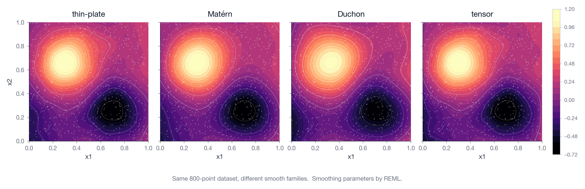

# Formula DSL reference

Every model in `gamfit` uses a Wilkinson-style formula:

```
response ~ term + term + ... + option(...)
```

Terms are joined with `+`. `*` and `:` are not supported — interactions come
from multivariate smooths (`s(x1, x2)`, `te(x1, x2)`, `matern(...)`,
`duchon(...)`).

This page lists every right-hand-side term, its options, and the
formula-level options (`link(...)`, `linkwiggle(...)`, `timewiggle(...)`,
`survmodel(...)`).

## The response (left of `~`)

| Response | What it triggers |
| --- | --- |
| `y` (continuous) | Gaussian family, identity link (default). |
| `y` (binary `{0, 1}`) | Binomial family, logit link (default). |
| `y` (count, with `link(type=log)` and explicit family) | Poisson. |
| `y` (positive continuous, with `link(type=log)`) | Gamma. |
| `Surv(entry, exit, event)` | Survival model. See [survival.md](survival.md). |

The family is detected from the response column. Override with `family=` or
`link()`.

## Linear and constrained coefficients

```
y ~ x                                # implicit penalized linear
y ~ linear(x)                        # same, explicit
y ~ linear(x, min=0)                 # box-constrained ≥ 0
y ~ linear(x, min=-1, max=1)         # box-constrained
y ~ nonnegative(x)                   # sugar for linear(x, min=0)
y ~ nonpositive(x)                   # sugar for linear(x, max=0)
y ~ bounded(x, min=0, max=1)         # exact interval transform (no ridge)
```

`linear(x, min=…, max=…)` keeps the penalized linear term and projects the
coefficient into `[min, max]`. `bounded(...)` applies an exact interval
transform instead, giving hard bounds without a ridge term pulling toward
zero.

`bounded(...)` supports a prior on the unit-scaled interior:

```
bounded(x, min=0, max=1, prior=uniform)
bounded(x, min=0, max=1, prior=center)               # Beta(2, 2)
bounded(x, min=0, max=1, target=0.5, strength=3)     # Beta from (target, strength)
bounded(x, min=0, max=1, beta_a=2.5, beta_b=2.5)     # explicit Beta(a, b)
```

`prior=` options:

- `none` — flat on the transformed scale, no penalty (default when no other
  prior args are set).
- `uniform` / `log-jacobian` — flat on the original scale (log-Jacobian
  correction).
- `center` — Beta(2, 2) toward the midpoint.

`target` ∈ `(min, max)` with `strength > 0` shorthand: sets
`a = 1 + strength·z`, `b = 1 + strength·(1−z)`, where
`z = (target − min) / (max − min)`.

Aliases for box constraints: `linear`, `constrain`, `constraint`, `box`.
`bounded(...)` is a separate term that uses an exact interval transform
plus an optional Beta prior (parameterised by `target` / `strength`)
rather than a quadratic ridge.

## Random effects

```
y ~ x + group(site)
y ~ x + re(site)            # alias
```

Adds a random intercept per level of the grouping column. The column may be
string- or integer-valued. Random slopes are not supported.

## Univariate smooths

```
y ~ s(x)                    # P-spline (B-spline + difference penalty)
y ~ smooth(x)               # alias
y ~ s(x, k=15)              # 15-dim basis
y ~ s(x, knots=10)          # 10 interior knots
y ~ s(x, degree=3, penalty_order=2)
y ~ s(x, type=ps)           # explicit P-spline
y ~ s(x, double_penalty=true)
```

For a single covariate, `s(x)` defaults to a cubic P-spline with a
second-order difference penalty. Options:

| Option | Default | Meaning |
| --- | --- | --- |
| `k` (or `basis_dim`) | auto from data | Total basis dimension. |
| `knots` | auto | Number of interior knots. Cannot combine with `k`. |
| `degree` | 3 | Polynomial degree of the B-spline. |
| `penalty_order` | 2 | Derivative order penalised (1 = slope, 2 = curvature). |
| `type` | `ps` (1-D), `tps` (2+D) | `ps`, `tps`, `matern`, `duchon`. |
| `double_penalty` | `true` | Add a ridge penalty alongside the difference penalty. |
| `bc` | `free` | Apply the same endpoint boundary condition on both ends: `free`, `clamped`, or `anchored`. |
| `bc_left`, `bc_right` | `free` | Per-endpoint boundary condition for half-open smooths. `clamped` forces zero endpoint derivative; `anchored` forces the endpoint value. |
| `anchor_left`, `anchor_right` | `0` | Anchor value for `bc_left=anchored` / `bc_right=anchored`. Currently only zero anchors are supported by the fitter. |

Examples:

```
y ~ s(x, bc_left=clamped)                 # starts flat, right end free
y ~ s(x, bc_left=anchored, bc_right=free) # starts at zero, right end free
y ~ s(x, bc=clamped)                      # zero slope at both endpoints
```

Default `k`: `clamp(unique_values / 4, 4, max(20, cbrt(unique_values)))`.

## Multivariate smooths

```
y ~ s(x1, x2)                       # thin-plate (default for ≥ 2 args)
y ~ tps(x1, x2)                     # alias
y ~ thinplate(x1, x2)               # alias
y ~ matern(x1, x2, x3)
y ~ duchon(x1, x2, x3)
y ~ te(x, z)                        # tensor product
y ~ tensor(x, z)                    # alias
```

### Thin-plate spline (`tps`, `thinplate`, `s(x1, x2)`)

Radial-basis surface smooth with thin-plate kernel.

| Option | Default | Meaning |
| --- | --- | --- |
| `centers` (or `k`) | auto | Number of radial basis centres. |
| `length_scale` | 1.0 | Global length scale. |
| `double_penalty` | `true` | Ridge + main penalty. |
| `scale_dims` | `false` | Standardize inputs per-axis before kernel eval. |

### Matérn (`matern`)

Radial basis with Matérn covariance kernel.

| Option | Default | Meaning |
| --- | --- | --- |
| `centers` (or `k`) | auto | Number of centres. |
| `length_scale` | 1.0 | Global length scale. |
| `nu` | `5/2` | Smoothness. Options: `1/2`, `3/2`, `5/2`, `7/2`, `9/2`. |
| `include_intercept` | `false` | Append a constant column. |
| `double_penalty` | `true` | Ridge + main penalty. |
| `scale_dims` | `false` | Per-axis anisotropy (learns axis contrasts). |

Higher `nu` gives smoother sample paths. `5/2` is smooth but not analytic.

### Duchon (`duchon`)

Radial basis with triple-operator regularization (mass + tension +
stiffness). Scale-free unless `length_scale` is given.

| Option | Default | Meaning |
| --- | --- | --- |
| `order` | auto | Polynomial nullspace order. `0`, `Linear`, or `Degree(d)`. |
| `power` | auto | Kernel power. |
| `centers` (or `k`) | auto | Number of centres. |
| `length_scale` | none | Optional global scale (hybrid mode). |
| `scale_dims` | `false` | Per-axis shape contrasts. Scale-free by default. |

Three independent penalties (mass, tension, stiffness) each get their own
smoothing parameter under REML.

### Tensor product (`te`, `tensor`)

Kronecker product of univariate B-spline bases. Each axis gets its own
smoothing parameter. Use when axes have different units (e.g. space × time).

| Option | Default | Meaning |
| --- | --- | --- |
| `k` | auto, per margin | Basis dim per margin. |
| `knots` | auto, per margin | Interior knots per margin. |
| `degree` | 3 | Polynomial degree (all margins). |
| `double_penalty` | `true` | Ridge + main penalty. |

### Picking the right smooth

The four multivariate families recover the same headline structure when
the truth is reasonable, but they take different paths to get there:



| You have... | Use... |
| --- | --- |
| One covariate | `s(x)` (P-spline). |
| Two coordinates in the same units (lat, lon) | `s(x, y)` (thin-plate) or `matern(x, y)`. |
| Coordinates in different units (space × time) | `te(x, t)`. |
| 3+ coordinates, especially in different units | `duchon(...)` with `scale_dims=true`, or `matern(...)`. |
| You want to control wiggliness directly | `matern(...)` with `nu`. |
| You want scale-free behaviour | `duchon(...)` without `length_scale`. |

### Periodic / cyclic smooths

```
y ~ s(theta, periodic=true, period=6.283)             # cyclic 1D B-spline
y ~ cyclic(theta, period_start=0, period_end=6.283)   # equivalent alias
y ~ periodic(theta, period=6.283)                     # alias of `cyclic`
y ~ cp(theta, period=6.283)                           # alias of `cyclic`
y ~ cc(day_of_week, period=7)                         # mgcv `bs="cc"` alias
y ~ duchon(theta, periodic=true)                      # cyclic Duchon (1D)

# Tensor with one or more periodic margins (cylinder, torus, …)
y ~ te(theta, h,  periodic=[0], period=[2*pi, None])
y ~ te(theta, phi, periodic=[0, 1], period=[2*pi, 2*pi])
y ~ te(day, hour, bc=['periodic','periodic'], periods=[7, 24], origins=[0, 0])
```

`periodic=[axes]` lists zero-based axis indices that wrap around; `period=`
or `periods=` holds one positive period per margin (`None` for non-periodic).
`origin=` / `origins=` fixes the half-open cyclic domain start when the
sample does not contain the true boundary. The
periodic margin uses a folded cardinal-cubic B-spline and a cyclic
difference penalty. `period_start`/`period_end` (1D) override the data range
when the angular domain is wider than the observed sample.

### Boundary-conditioned 1D smooths

```
y ~ s(x, bc=clamped)                       # zero first derivative at both ends
y ~ s(x, bc=clamped, side=left)            # zero first derivative at the start
y ~ s(x, bc_left=anchored, anchor_left=0)  # endpoint value pinned to 0
y ~ s(x, start_bc=clamped, end_bc=anchored, end_anchor=0)
```

Endpoint conditions are imposed by projecting onto the null space of the
boundary-condition rows (Wood §5.4.1), so the constrained smooth honours
the condition exactly. Aliases: `bc_left|left_bc|start_bc`, plus
`bc_right|right_bc|end_bc`. Values: `free|none|open`, `clamped|zero_derivative`,
`anchored|zero|zero_value`. Per-side anchor overrides: `anchor_<side>`,
`<side>_anchor`, falling back to global `anchor`/`anchor_value`/`value`.

### Intrinsic S² (sphere) smooth

```
y ~ sphere(lat, lon)                                    # Wahba kernel, m=2
y ~ sos(lat, lon)                                       # alias of sphere()
y ~ spherical(lat, lon)                                 # alias of sphere()
y ~ s(lat, lon, type=sphere)                            # equivalent
y ~ s(lat, lon, bs=sos)                                 # mgcv alias
y ~ sphere(lat, lon, m=3, radians=true, k=64)           # m∈{1..4}; centers=k
y ~ sphere(lat, lon, method=harmonic, max_degree=6)     # spherical-harmonic
```

| Option | Default | Meaning |
| --- | --- | --- |
| `method` | `wahba` | `wahba` (reproducing kernel) or `harmonic` (spherical harmonics). |
| `m` (`order`, `penalty_order`) | 2 | Wahba pseudo-spline order (1..4). |
| `max_degree` (`L`, `harmonic_degree`) | auto | Maximum harmonic degree L; basis dim = L(L+2). |
| `centers` (`k`) | auto | Wahba center count. |
| `radians` (`units=radians`) | `false` | Treat lat/lon as radians (default: degrees). |
| `double_penalty` | `true` | Add a ridge-like null-space shrinkage penalty. |

The Wahba and harmonic constructions are both intrinsic on the sphere
(rotation-invariant). Harmonic is fixed-rank and has a diagonal Laplace-
Beltrami squared penalty; Wahba uses centers via the closed-form
reproducing kernel.

## Adaptive anisotropy

For multi-d smooths that support it, add `scale_dims=true` (or set
`scale_dimensions=True` on `fit()`) to learn per-axis shrinkage:

```python
gamfit.fit(
    df,
    "y ~ matern(pc1, pc2, pc3, pc4)",
    scale_dimensions=True,
)
```

- **Matérn / hybrid Duchon (with `length_scale`):** optimizes a global scale
  plus centered per-axis contrasts.
- **Pure Duchon (no `length_scale`):** optimizes only the centered per-axis
  contrasts; stays scale-free.
- **Thin-plate / tensor:** standardizes inputs per axis before kernel
  evaluation.

## Link function

```
y ~ x + link(type=identity)
y ~ x + link(type=logit)
y ~ x + link(type=probit)
y ~ x + link(type=cloglog)
y ~ x + link(type=log)
y ~ x + link(type=sas)
y ~ x + link(type=beta-logistic)
y ~ x + link(type=blended(logit, probit))
y ~ x + link(type=flexible(probit))
```

| `link(type=...)` | What you get |
| --- | --- |
| `identity` | `g⁻¹(η) = η`. Default for Gaussian. |
| `logit` | `g⁻¹(η) = 1/(1+e^{-η})`. Default for binomial. |
| `probit` | `g⁻¹(η) = Φ(η)`. |
| `cloglog` | `g⁻¹(η) = 1 − e^{−e^{η}}`. |
| `log` | `g⁻¹(η) = e^η`. For counts and positive-continuous. |
| `sas` | Sinh-arcsinh skewed link. Don't combine with `linkwiggle`. |
| `beta-logistic` | Bounded link. Don't combine with `linkwiggle`. |
| `blended(a, b, …)` | Mixture of two or more component inverse links (e.g. `logit`, `probit`, `cloglog`, `loglog`, `cauchit`). |
| `flexible(base)` | A spline offset from a base link. Enables `linkwiggle`. |

Set it from Python with `link=` on `fit()`:

```python
gamfit.fit(df, "case ~ s(age)", link="logit")
```

`link(type=...)` in the formula and `link=` on `fit()` are equivalent. If
both are set, the formula wins.

## `linkwiggle` — flexible link offset

```
y ~ s(x) + link(type=flexible(probit))
y ~ s(x) + linkwiggle(internal_knots=10)
y ~ s(x) + linkwiggle(degree=2, internal_knots=8, penalty_order=all)
```

Adds a spline offset to a base link. The data can correct for link
misspecification; the base link is the prior.

| Option | Default | Meaning |
| --- | --- | --- |
| `internal_knots` | ~10 | Interior knots for the offset spline. |
| `degree` | 3 | Polynomial degree (≥ 1). |
| `penalty_order` | `all` (= 1, 2, 3) | Which derivatives to penalise. Comma-separated `slope`, `curvature`, `curvature-change` (or `1, 2, 3`), or `all`. |
| `double_penalty` | `true` | Ridge + main penalty. |

Available with `identity`, `log`, `logit`, `probit`, `cloglog` base links.
Not with `sas`, `beta-logistic`, or `blended(...)`.

## `timewiggle` — survival-only baseline offset

```
Surv(entry, exit, event) ~ age + timewiggle(internal_knots=8)
```

Same options as `linkwiggle`. Adds a spline offset to the survival time
basis so the baseline hazard can deviate from a parametric form. Survival
formulas only. See [survival.md](survival.md).

## `survmodel` — survival configuration

```
Surv(entry, exit, event) ~ age + survmodel(spec=net, distribution=gaussian)
```

| Option | Meaning |
| --- | --- |
| `spec` | Baseline specification, e.g. `net`. |
| `distribution` | Distributional assumption, e.g. `gaussian`. |

Pair with `survival_likelihood=` on `fit()` and the `--predict-noise` route.
See [survival.md](survival.md).

## Examples

```python
# Simple GAM with a smooth and a linear term
"y ~ s(bmi) + age"

# Spatial smooth with per-axis anisotropy
"z ~ matern(lat, lon, scale_dims=true)"

# Tensor of space × time
"y ~ te(x_coord, time, k=8)"

# 4-D scale-free Duchon
"y ~ duchon(pc1, pc2, pc3, pc4, centers=50)"

# Constrained linear + bounded proportion + linear age
"y ~ nonnegative(cost) + bounded(prop, min=0, max=1, target=0.5, strength=2) + age"

# Logistic with flexible link
"case ~ s(age) + link(type=flexible(probit)) + linkwiggle(internal_knots=6)"

# Survival with transformation likelihood + smooth covariate
"Surv(entry, exit, event) ~ s(age) + bmi"

# Random intercept per site
"y ~ smooth(x) + group(site)"
```
