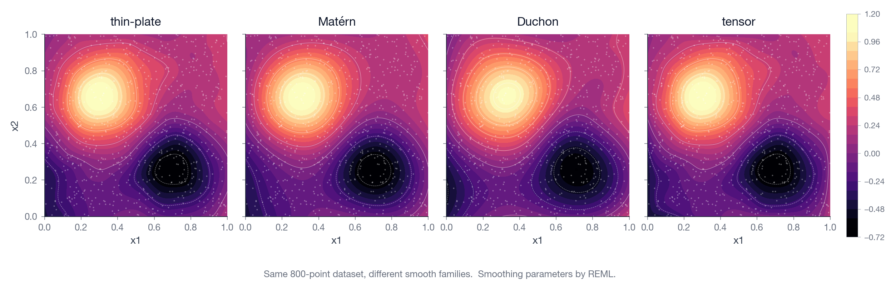

# Formula DSL reference

Every model in `gamfit` uses a Wilkinson-style formula:

```
response ~ term + term + ... + option(...)
```

Terms are joined with `+`. Wilkinson-Rogers operators are supported for
ordinary linear atoms:

- `x:z` adds the interaction only.
- `x*z` expands to `x + z + x:z`.
- `x/z` expands to `x + x:z`.
- `(x + z + w)^2` expands all non-empty interactions up to order 2.

Function-call terms such as `s(x)` are opaque to those operators; use
multivariate smooths (`s(x1, x2)`, `matern(...)`, `duchon(...)`),
intrinsic sphere smooths (`sphere(lat, lon)`), and tensor-product
smooths (`te(...)`, `ti(...)`) for smooth interactions.

This page lists each right-hand-side term, its options, and the
formula-level configuration terms (`link(...)`, `linkwiggle(...)`,
`timewiggle(...)`, `survmodel(...)`).

### Column names that are not identifiers

A column whose name is not a plain identifier — it has a space, a dot, a
hyphen, a leading digit, or non-ASCII letters — is written in backticks,
anywhere a column name is accepted, the response included:

```
`body mass` ~ s(`flipper.length`) + `2nd dose` + factor(`site id`)
```

Everything between the backticks is the column name, verbatim. Plain
identifiers need no quoting (`s(x)` and ``s(`x`)`` are the same term).

### Option values are checked

Every option a term accepts is parsed strictly. An unknown option name, a
value of the wrong type (`k=ten`, `double_penalty=maybe`), and an
out-of-range value (`k=0`, `degree=-1`) are errors that name the term and
the option, e.g. ``in term s(x, k=ten): option `k=ten` is not a
non-negative integer``. Nothing is silently clamped or ignored; in
particular `penalty_order` must satisfy `1 <= penalty_order <= degree`,
because the `m`-th derivative of a degree-`d` spline is identically zero
for `m > d` and such a penalty would penalize nothing.

## Response (left of `~`)

| Response | Default behaviour |
| --- | --- |
| `y` continuous | Gaussian family, identity link. |
| `y` binary `{0, 1}` | Binomial family, logit link. |
| `y` non-negative integer count (at least one value `>= 2`) | Poisson family, log link. |
| `Surv(entry, exit, event)` | Survival model. See [survival.md](survival.md). |

The family is inferred from the response. A link that several families admit
(`link(type=log)`, `link(type=inverse)`) does not choose the family: set with
no `family=`, it is an error that names the admitting families. `family=` accepts `gaussian`, `binomial`
(aliases `binomial-logit`, `binomial-probit`, `binomial-cloglog`),
`latent-cloglog-binomial`, `poisson`, `negative-binomial`, `gamma`, `inverse-gaussian`,
`beta`, `tweedie`, `royston-parmar`, and `multinomial`. Survival,
transformation-normal, and Bernoulli
marginal-slope families are selected through `Surv(...)` or dedicated
fit options rather than `family=`.

## Every remaining column (`.`)

```
y ~ .                                # one term per column, chosen from the data
y ~ s(x, k=12) + .                   # explicit terms first, `.` covers the rest
```

`.` stands for every column no other part of the fit reads: not the
response, a column an explicit term names, or a weights, offset or
auxiliary-formula column. Each column gets a penalized term whose null
space is penalized too, so a column that carries no signal shrinks to
about zero effective degrees of freedom:

| Column | Term |
| --- | --- |
| numeric, at least 3 distinct values | `s(col)` |
| numeric with 2 distinct values (including bool) | `col` (penalized linear) |
| categorical or string with repeated levels | `factor(col)` (random effect) |
| categorical in which every level occurs once (a row id) | dropped, with a note |
| a single value | dropped, with a note (the intercept already fits it) |

Three distinct values is the smallest number a second-order
difference-penalized smooth can separate from its linear null space.
With two values the column can only enter linearly.

`gam fit data.csv "y ~ ."`, `gamfit.fit(df, "y ~ .")` and
`GAMRegressor().fit(X, y)` all use the same Rust rule. The expanded
formula is printed to stderr by the CLI and reported as a
`GamInferenceWarning`. It is also stored as `model.formula` (and
`formula_` on the estimators).

## Linear and constrained coefficients

```
y ~ x                                # implicit penalized linear
y ~ linear(x)                        # explicit linear
y ~ x * z                            # x + z + x:z
y ~ x / z                            # x + x:z
y ~ linear(x, min=0)                 # box-constrained coefficient >= 0
y ~ linear(x, min=-1, max=1)         # box-constrained coefficient
y ~ nonnegative(x)                   # sugar for linear(x, min=0)
y ~ nonpositive(x)                   # sugar for linear(x, max=0)
y ~ bounded(x, min=0, max=1)         # exact interval transform on x
```

`linear(x, min=..., max=...)` keeps a penalized linear term and
projects the coefficient into `[min, max]`. Each bound is optional.
Other names for the function (`constrain()`, `constraint()`, `box()`)
and for the bounds (`lower=`, `upper=`) are refused with an error that
names `linear()`, `min=` or `max=`.

`bounded(x, min, max)` applies an exact interval transform to `x`
whenever it carries a prior. With `prior=uniform` it is the unpenalised
constrained linear term `linear(x, min=, max=, double_penalty=false)`.
Required options: `min` and `max` (finite, `min < max`).

### bounded() priors

`bounded()` accepts one of `prior=`, `target=`+`strength=`, or no
prior option:

```
bounded(x, min=-1, max=1)                  # default: prior=shrinkage
bounded(x, min=0, max=1, prior=uniform)
bounded(x, min=0, max=1, prior=center)
bounded(x, min=0, max=1, target=0.5, strength=3)
```

`prior=` values:

- `shrinkage` (the default when no prior option is given) — a Gaussian
  prior on the latent logit coordinate of the interval transform,
  centred at the null, with its precision estimated by REML like any
  other smoothing parameter. A coefficient the data do not support is
  shrunk back to the null. The null is `0` when `min < 0 < max`. When
  zero lies outside the box it is not an admissible value, and the
  prior centres at the box midpoint `(min + max) / 2`, the point of the
  interval map that favours neither bound.
- `uniform` — no prior and no penalty beyond the box itself: flat on the
  box of the coefficient. It is exactly
  `linear(x, min=, max=, double_penalty=false)`. The bounds are linear
  inequality constraints, so the posterior mode is the constrained
  maximum-likelihood fit and sits on the bound when the box binds; the
  published coefficient is the mean of that truncated posterior. It
  cannot take `double_penalty=true`. (A flat prior on the logit chart
  would be improper: the likelihood tends to a positive constant as the
  chart runs to either rail. Flat on the box pulled back to the chart is
  proper, but its chart mode is not the box posterior's mean.) `none` is
  refused with an error that names `uniform`.
- `center` — `Beta(2, 2)` toward the midpoint.

`target` plus `strength` is shorthand for a Beta prior:
`a = 1 + strength * z`, `b = 1 + strength * (1 - z)` with
`z = (target - min) / (max - min)`. `target` must lie strictly between
`min` and `max`; `strength` must be positive.

`prior=` and `target`/`strength` are mutually exclusive. `pull=` is
refused; use `prior=`.

## Removing the intercept {#removing-the-intercept}

```
y ~ 0 + x                 # regression through the origin (penalized slope)
y ~ x - 1                 # the same model
y ~ 0 + linear(x, double_penalty=false)   # unpenalized: OLS through the origin
y ~ 0 + g                 # g spans the constant: the same model as y ~ g
y ~ 0 + s(x) + s(z)       # s(x) spans the constant: the same model as y ~ s(x) + s(z)
```

`0 + …`, `… + 0` and `… - 1` remove the global intercept; `1 + …` (or
`+ 1`) keeps it, which is the default. The constant is never penalized: a
shift of the response shifts the fit and nothing else. Every other
direction keeps its penalty, so a term with no support in the data can
still be shrunk to zero.

Removing the intercept therefore removes the constant only when no term
could represent it. A term that spans the constant keeps the intercept, and
the model is exactly the one written with it:

- **A fixed factor** — `+ g`, `factor(g)`, or the main effect of a
  factor `by=` smooth. `0 + g` is `g`: every level keeps its column and its
  REML-estimated ridge. Beside the free intercept that ridge shrinks only the
  contrasts between levels, so the overall level is free and the level
  differences shrink toward zero when the data do not support them.
- **A pure-indicator interaction over every level** (`g:h` with no `g` or
  `h` main effect). `0 + g:h` is `g:h`: one reference cell is absorbed by the
  intercept and every other cell keeps its ridge.
- **A B-spline or tensor smooth** (`s(x)`, `te(x, z)`, …) with the default
  centring or `identifiability=none`. `0 + s(x)` is `s(x)`: the smooth stays
  centred and keeps its null-space ridge, so its linear part is shrunk like
  any other and only the constant is free.

The column space is the one the formula wrote; the coefficients are
parametrized as the intercept plus centred effects, and the fit reports an
inference note naming the term that kept the intercept.

A random effect (`group(g)`, `s(g, bs="re")`) never spans the
constant: its levels are mean-zero deviations. When no term spans it, the
model has no constant at all and every effect passes through the origin,
exactly as a parametric no-intercept fit does. `y ~ 0 + linear(x,
double_penalty=false)` is ordinary least squares through the origin, to
rounding. The default `y ~ 0 + x` also passes through the origin, but its
slope carries the same REML-selected shrinkage ridge as `x` in `y ~ x`
(see [Linear and constrained coefficients](#linear-and-constrained-coefficients)),
so it sits slightly toward zero from the least-squares slope when the data
support shrinkage.

## Random effects and factor smooths

```
y ~ x + group(site)                      # random intercept per level
y ~ x + factor(site)                     # same penalized block as bare `+ site`; forces categorical encoding
y ~ s(time, by=treatment) + treatment    # separate smooth per factor level
y ~ s(time, by=dose)                     # numeric varying-coefficient smooth: f(time)·dose, f keeps its constant
y ~ s(time, subject, bs="fs")           # partial-pooling random smooths
y ~ fs(time, subject)                    # alias for bs="fs"
y ~ s(time) + s(subject, time, bs="sz") # sum-to-zero factor deviations
y ~ sz(subject, time)                    # alias for bs="sz"
y ~ group(subject) + s(subject, time, bs="re")  # random intercept + slope
```

`group(g)` and `s(g, bs="re")` add a random intercept per level of the
grouping column. The column may be string- or integer-valued. Random slopes are
supported with `s(x, group, bs="re")`, usually paired with `group(group)` for
random intercepts.

### How categorical terms are estimated {#factor-terms}

A bare string column (`+ site`), `factor(site)` and `group(site)` all build
the same term: one coefficient per level, with a ridge penalty on those
coefficients whose strength REML estimates along with every other smoothing
parameter. On the same data the three spellings choose the same smoothing
parameter and give the same predictions for every level seen in training.
No spelling fits an unpenalized fixed effect, with or without an intercept
in the formula (see [Removing the intercept](#removing-the-intercept)).

They differ in two ways only:

| Spelling | Numeric column | Level unseen in training |
| --- | --- | --- |
| `+ site` | used as a numeric slope | `predict` raises `gamfit.errors.PredictionError` (a `DataError`); `check()` reports it |
| `factor(site)` | forced to categorical levels | `predict` raises `gamfit.errors.PredictionError` (a `DataError`); `check()` reports it |
| `group(site)` | forced to categorical levels | predicted at the population level (the level effect is 0) |

So `factor(year)` treats `year` as levels rather than as a slope, and a
held-out level is a schema mismatch for `+ site` and `factor(site)` but an
expected new group for `group(site)`.

`factor()` and `group()` take no options: the penalty
strength is always estimated, so `factor(site, k=3)` is rejected as an
unknown option instead of being ignored. `factor(site)` is the only
spelling of the level effect: `C(site)` is rejected with an error that
points to `factor(site)`. A categorical column is also
refused inside a term that treats its inputs as numeric axes (`linear()`,
`s()`, `te()`, `thinplate()`, `matern()`, cyclic smooths and the other
non-factor bases): the error points to `factor(site)` or `group(site)` for
the level effect, or `s(x, by=site)` / `fs(x, site)` for a per-level
smooth of a numeric `x`.

Why estimate the penalty rather than leave the levels unpenalized? The
penalized estimate is the random-effect (partial-pooling) estimate, and
REML decides how much pooling the data support. When every level has plenty
of rows, the estimated penalty is weak and the level effects match the
unpenalized ones almost exactly; in the `Wage` data the five education
levels keep an edf of about 3.98 of a possible 4. When some levels have
few rows, their effects are pulled toward the overall mean instead of
resting on a handful of observations. Both cases use one rule and no
tuning, the same rule every smooth in the model uses.

## Univariate smooths {#univariate-smooths}

```
y ~ s(x)                    # penalized B-spline (exact derivative roughness penalty)
y ~ smooth(x)               # alias of s()
y ~ s(x, k=15)              # basis dimension 15
y ~ s(x, knots=10)          # 10 interior knots
y ~ s(x, degree=3, penalty_order=2)
y ~ s(x, bs=ps)           # explicit P-spline
y ~ s(x, double_penalty=true)
y ~ s(x, bc_left=anchored, anchor_left=0)  # known start value and zero start slope
y ~ s(x, bc=clamped)        # zero slope at both endpoints
```

For a single covariate, `s(x)` defaults to a cubic B-spline whose roughness
penalty is the exact integrated squared second derivative,
`∫ (f''(x))² dx = βᵀ S β` with `S_ij = ∫ B_i'' B_j'' dx`, assembled in closed
form from the basis. This is a Sobolev penalty on the represented *function*,
not the classical Eilers–Marx P-spline coefficient-difference penalty
`‖Δ²β‖²`: the two share a null space (polynomials of degree below
`penalty_order`) but are different matrices — most visibly on non-uniform
knots and at the boundary — so `bs=ps` names this basis family, not a
difference-penalty model, and fits are not expected to coincide with a
difference-penalized P-spline of the same dimension.

| Option | Default | Meaning |
| --- | --- | --- |
| `k` | from data | Total basis dimension. |
| `knots` | from data | Number of interior knots. Cannot combine with `k`. |
| `degree` | 3 | Polynomial degree of the B-spline. |
| `penalty_order` | 2 | Derivative order penalised (1 = slope, 2 = curvature). |
| `bs` | `ps` (1-D), `tps` (2+D) | `ps`, `tps`, `matern`, `duchon`, `sphere`. |
| `double_penalty` | `true` | Add a null-space ridge penalty alongside the roughness penalty. |
| `bc` | `none` | Boundary condition for both endpoints: `none`, `clamped` (zero first derivative), or `anchored` (fixed value and zero first derivative). Combine with `side=left`/`right` for half-open smooths. |
| `bc_left`, `bc_right` | inherit from `bc` | Per-endpoint overrides, with aliases `start_bc`/`end_bc`. |
| `anchor`, `anchor_left`, `anchor_right` | `0` for anchored endpoints | Fixed endpoint value(s) when an endpoint uses `anchored`. |
| `domain` | data range | `[lower, upper]` interval the spline is built on. See [Fixing the spline's interval](#spline-domain). |
| `shape` | `none` | Shape constraint: `monotone_increasing`, `monotone_decreasing`, `convex`, `concave`, or a list of them that must all hold (`[monotone_increasing, concave]`). See [Shape-constrained smooths](#shape-constrained-smooths). |

Boundary conditions are available for 1-D P-spline smooths. They are useful for trajectories with a known start or end: `bc_left=anchored, anchor_left=0` fixes the left endpoint value and slope while leaving the right endpoint open; `bc_right=clamped` forces a flat terminal slope.

The 1-D B-spline path accepts these options plus `periodic`, `period`,
`periods`, `period_start`, `period_end`, `origin`, `identifiability`.

### Fixing the spline's interval (`domain=`) {#spline-domain}

```
y ~ s(age, domain=[0, 100])             # basis spans [0, 100], not min..max(age)
y ~ s(x, bs=cr, k=8, domain=[0, 1])     # cr end knots at 0 and 1
y ~ te(x, z, domain=[[0, 1], none])     # per margin: fix x, z keeps its data range
```

By default an open (non-periodic) spline's boundary knots sit at the minimum
and maximum of the fitted column, so the basis — and therefore the fit —
depends on which rows happened to be sampled. `domain=[lower, upper]`
declares the interval instead: the clamped boundary knots are placed at
`lower` and `upper`, generated interior knots are spread over it, and a
`bs=cr` basis puts its end value-knots there. Quantile knot placement
keeps its interior knots at data quantiles and moves only the boundary knots
to the domain. Explicit interior `knots=[...]` must lie inside it. Two
samples of different extent inside the same domain therefore build exactly
the same basis. Bounds accept numeric expressions (`domain=[0, 2*pi]`).

On `te()`/`ti()` the option takes one entry per margin, each an interval or
`none` (keep that margin's data range): `domain=[[0, 1], [-5, 5]]`.

Fitted data must lie inside the domain: a row outside it is an error that
names the column and its observed span, rather than a silent widening.
At **prediction** time a point outside the domain is evaluated by linear
extrapolation from the boundary, as for any clamped B-spline. `domain=` is
for open splines only; a periodic axis takes its interval from
`period=`/`period_start=`/`period_end=` (or `origins=` on a tensor margin),
and combining the two is an error. (`boundary=` is unrelated: it sets the
endpoint condition, e.g. `boundary=periodic` or `bc=clamped`.)

`identifiability=` selects the smooth's own gauge. On the 1-D B-spline path —
`s()` and `cyclic()` — and on `matern()`, the vocabulary is:

| Value | Meaning |
| --- | --- |
| `sum_tozero` (aliases `centered`, `sum-to-zero`) | Default. Center the smooth so it cannot compete with the global intercept. Not applied to a smooth with a continuous `by=` variable: `s(x, by=z)` is the varying coefficient `f(x)·z`, whose constant direction is `z` itself, so `f` keeps its constant and the double penalty's null-space ridge decides whether it exists. Do not add a separate `z` main effect alongside it. |
| `none` | Keep the unconstrained basis columns. The smooth then spans the constant, which is aliased with the intercept; the double penalty's null-function ridge is what keeps the fit identified, so `double_penalty` must stay on. |
| `linear` (alias `remove_linear_trend`) | Remove the constant *and* linear directions, so the smooth carries only curvature and a separate parametric `x` term is free to take the slope. |

Three combinations are refused rather than silently resolved: an anchored
endpoint already fixes the smooth's level, so it cannot also be centered
(use `identifiability='none'`, which is what an anchored smooth defaults to);
and `linear` needs open-knot B-spline geometry, so it is not available on a
periodic basis (a linear trend is not periodic) or on `bs='cr'`/`'cs'`
(a natural cubic regression basis is indexed by values at knots, not by a
B-spline coefficient chart).

The vocabulary is not identical on every smooth kind, and each one refuses a
token it does not know. `te()`/`ti()` take `none`, `sum_tozero` and
`marginal_sum_tozero`; `thinplate()` / multivariate `s(x1, x2, ...)`,
`duchon()` and the other radial smooths take `none` and
`orthogonal_to_parametric`.

`cyclic(x, ...)` is shorthand for a periodic 1-D
B-spline. It accepts the same period declaration two equivalent ways: a
period length via `period=` (with an optional `origin=` for the domain
start), or an explicit domain via `period_start=`/`period_end=`. All of
these accept symbolic numeric expressions — e.g. `period=2*pi`,
`period_end=tau`, `period=0.5*tau` — exactly as `s(..., periodic=true)`
does, so `cyclic(x, period=2*pi)` and `cyclic(x, period_start=0,
period_end=2*pi)` describe the same `[0, 2π)` smooth. An unparseable
endpoint or an unknown option is rejected rather than silently dropped.

Default basis of a 1-D `s(x)`: the data size it. The fit starts from a
pilot of `clamp(unique_values / 4, 4, 8)` interior knots (at most twelve
cubic basis functions). With 32 or fewer rows and five or more smooth
coordinates the pilot is reduced to at most 1 interior knot. After the fit
converges, the basis is checked for two signs that it is too small: an edf
pressed against the basis dimension, and a rejection by the residual
lack-of-fit test that
[`basis_check()`](diagnostics.md#basis_check-is-the-basis-big-enough)
reports, at a family-wise level of `1e-3` Bonferroni-corrected over the
tested smooths. If either appears, the knot count doubles and the model is
refit, until neither does. Only the data bound the growth:

- a smooth never gets more coefficients than its covariate has distinct
  values, which is the interpolating limit;
- the whole model keeps at least one residual degree of freedom.

A null or linear truth passes at the pilot, and REML shrinks it to about 0
or 1 edf. The larger basis is built only where the fit shows it is needed.

The basis dimension is `k = internal_knots + degree + 1`. Setting `k=` or
`knots=` fixes the size: an explicit `k` is honoured exactly, down to
`k = degree + 1` (zero interior knots), and never grows. Passing both `k`
and `knots` is an error. A Python smooth override (`smooths=`) also keeps
its size. So do a `by=` smooth (only the rows its gate selects support it)
and the cyclic, factor-smooth and tensor-product bases, which take the
pilot count as a fixed default. Thin-plate, Duchon and the other radial
smooths with automatic centers grow their center count by the same
adequacy loop. Matérn is the exception and keeps its default count.

### Choosing `k` {#choosing-k}

For a default `s(x)` there is nothing to choose. Leave `k` unset and the
fit sizes the basis from the data, as described above.

Setting `k` fixes the basis dimension. That is an upper bound on how
flexible the smooth can be, not the flexibility itself. REML chooses the
smoothing parameter, and so how much of the basis the fit uses: the
smooth's effective degrees of freedom (edf) can sit anywhere from its
unpenalized null space up to the basis dimension. A `k` above what the data
need changes the fit very little, because the penalty holds the extra basis
functions back. It costs time, not accuracy.

A fixed basis can fail in one way: it can be too small for the truth. An edf
close to the basis dimension is the symptom, and
[`basis_check()`](diagnostics.md#basis_check-is-the-basis-big-enough)
is the test: it looks for structure left in the residuals along the
covariate. A small p-value means the basis ran out. For `s(x)`, drop the
`k=` and let the default grow. A basis that never grows by itself (a `by=`
smooth, or a tensor-product, cyclic, factor-smooth or Matérn smooth) needs a
larger `k`.

```python
import numpy as np
import pandas as pd
import gamfit

rng = np.random.default_rng(0)
x = np.sort(rng.uniform(0, 1, 1000))
truth = np.sin(12 * np.pi * x)
data = pd.DataFrame({"x": x, "y": truth + rng.normal(0, 0.3, x.size)})

for formula in ["y ~ s(x, k=12)", "y ~ s(x)"]:
    model = gamfit.fit(data, formula)
    check = model.basis_check(data)[0]
    error = np.sqrt(np.mean((model.predict(data) - truth) ** 2))
    print(f"{formula:16s} basis_dim={check['basis_dim']:2d}  edf={check['edf']:5.1f}  "
          f"basis check p={check['p_value']:.2g}  RMSE vs truth={error:.3f}")
```

Six full periods of a sine need more than a dozen basis functions. The
fixed `k=12` basis runs out: its edf (10.4) presses against the basis
dimension (11 after centering), the basis check's p-value is about
`1e-309`, and the error against the truth is 0.63. The default `s(x)`
starts from the same dozen functions, sees the same rejection, and doubles
its knots until the check's p-value clears the engine's basis-adequacy
level (`1e-3`, Bonferroni-corrected over the tested smooths). Here it
stops at 19 dimensions with an edf of 17.8, a basis check p of about
0.007, and an error of 0.07. Nobody had to tell it how many.

### Shape-constrained smooths {#shape-constrained-smooths}

```
y ~ s(x, shape=monotone_increasing)   # f'(x) >= 0 on the knot range
y ~ s(x, shape=monotone_decreasing)   # f'(x) <= 0
y ~ s(x, shape=convex)                # f''(x) >= 0
y ~ s(x, shape=concave, k=12)         # f''(x) <= 0
y ~ s(x, shape=[monotone_increasing, concave])      # both at once
y ~ te(x, z, shape=[monotone_increasing, none])     # increasing in x at every z
y ~ s(x, by=g, shape=monotone_increasing)           # every level of factor g
```

Accepted spellings (case and hyphens are ignored): `none`;
`monotone_increasing` (`monotonic_increasing`, `increasing`, `mono_inc`,
`mpi`); `monotone_decreasing` (`monotonic_decreasing`, `decreasing`,
`mono_dec`, `mpd`); `convex` (`cvx`); `concave` (`ccv`). From Python,
`gamfit.fit(..., constraints={"s(x)": "monotone_increasing"})` rewrites the
formula into the same `shape=` option; a Python list or tuple value becomes a
bracketed list.

The constraint is exact, not a penalty and not a check on a grid of points.
The B-spline coefficients are written as `β = C·δ`, where `δ` holds
successive coefficient differences (monotone) or knot-scaled slope
differences (convex/concave), and the solver enforces `δ ≥ 0`. A
non-negative control-polygon difference makes the spline itself monotone
(or convex) everywhere on the knot range. The roughness penalty stays the
function penalty `βᵀSβ`, carried into `δ` coordinates by congruence.

A shape-constrained smooth is centred like an unconstrained one. The chart
drops the constant ("level") direction, which the B-spline partition of
unity would otherwise make identical to the intercept. It also subtracts
each increment column's weighted training mean, which leaves every
coefficient difference, and so the cone, unchanged. The fitted term then
sums to zero over the training rows and the intercept carries the level.
`identifiability=` takes `sum_tozero` (the default) or `none`. With `none`,
the constant stays in the chart as an unbounded level coordinate. `linear`
is refused because removing a linear trend is not compatible with the cone.

**Lists.** `shape=[a, b]` imposes every listed shape. A single shape keeps
the `δ ≥ 0` chart above; a list enters the solver as the merged inequality
rows `A·β ≥ 0`, written in the same centred chart (difference rows annihilate
constants, so centring leaves them exact). Duplicate atoms are merged, and a
monotone row made redundant by a curvature constraint is dropped: under
`concave` a spline is non-decreasing exactly when its last slope is, so only
that endpoint row is kept. Contradictions are refused with the class they
would force: `monotone_increasing` with `monotone_decreasing` leaves only a
constant, `convex` with `concave` only an affine function.

**Tensor products.** `te(x, z, shape=[s_x, s_z])` takes one entry per
margin, in margin order; each is a shape, `none`, or a list. A constrained
margin contributes its exact 1-D cone Kroneckered with identities on the
other margins (`I ⊗ A_x ⊗ I`), so the surface has that shape along the
margin at every value of the others. Every margin of a shaped `te()` is an
open B-spline: with no `bs=` all margins default to `ps` rather than `cr`,
and `bs='cr'` on a shaped margin is refused (its coefficients are knot
values, not control points). `ti()` is refused, because its slices average
to zero over the other margins, and a monotone slice with zero average is
identically zero. A single entry for a multi-margin `te()` is refused with
the entry count it needs.

**`by=`.** With a factor `by=`, every level's curve carries the full cone
on its own coefficient block. With a numeric `by=z` the cone constrains
`f` in `z·f(x)`, so the product has the stated shape in `x` only where
`z ≥ 0`, and the mirrored shape where `z < 0`.

Only open 1-D B-spline `s(x)` smooths, `te()` products of them, and either
with `by=` accept `shape=`. Periodic (`cyclic()`), cubic-regression
(`bs='cr'`/`'cs'`) and boundary-conditioned bases, and
thin-plate/Duchon/Matérn/sphere smooths reject a non-`none` shape with an
error.

The [tour](tour.md#shape-constraints-a-monotone-curve-cars) fits a
monotone curve to real data.

### Boundary-conditioned 1-D smooths {#boundary-conditioned-1d-smooths}

Boundary-condition values: `free`/`none`/`open`,
`clamped`/`zero_derivative`, `anchored`/`zero`/`zero_value`. `clamped`
forces zero first derivative at the endpoint; `anchored` is a Hermite pin that
fixes both the endpoint value and its first derivative (anchor defaults to 0,
currently the only supported anchor value).

```
y ~ s(x, bc=clamped)                       # zero slope at both endpoints
y ~ s(x, bc_left=clamped)                  # zero slope at the start, free at end
y ~ s(x, bc_left=anchored, anchor_left=0)  # endpoint value 0 and slope 0
y ~ s(x, start_bc=clamped, end_bc=anchored, anchor_right=0)
```

Use `s(x, bc=clamped)` for the boundary-conditioned form (`boundary=` and
`boundary_conditions=` are accepted spellings of the same option). Per-side
overrides are read directly by the smooth builder.

`side=` says *which* endpoint the global `bc=` applies to, and `anchor=` (with
its per-side spellings) says *what* an anchored endpoint is pinned to. Neither
means anything alone, so each is rejected without the condition it qualifies
rather than silently ignored.

## Multivariate smooths

```
y ~ s(x1, x2)                # thin-plate (default for >=2 args)
y ~ tps(x1, x2)              # alias of thin-plate
y ~ thinplate(x1, x2)        # alias
y ~ thin_plate(x1, x2)       # alias
y ~ matern(x1, x2, x3)
y ~ duchon(x1, x2, x3)
y ~ sphere(lat, lon)                # intrinsic S² smooth
```

### Thin-plate (`tps`, `thinplate`, multivariate `s(...)`)

Radial-basis surface smooth with thin-plate kernel.

| Option | Default | Meaning |
| --- | --- | --- |
| `centers` (`k`) | auto | Number of radial centres. |
| `length_scale` | `1.0` | Global length-scale init. |
| `double_penalty` | `true` | Ridge + main penalty. |
| `by`, `identifiability` | — | `identifiability` takes `none` or `orthogonal_to_parametric`; see [univariate smooths](#univariate-smooths). |

`include_intercept` is a Matérn option and is rejected here: the thin-plate
basis already spans its polynomial null space (the constant and linear terms),
so an appended constant column would be exactly collinear with one already in
the span.

### Matérn (`matern`)

Radial basis with Matérn covariance kernel.

| Option | Default | Meaning |
| --- | --- | --- |
| `centers` (`k`) | auto | Number of centres. |
| `length_scale` | `1.0` | Global length-scale init. |
| `nu` | `5/2` | Smoothness, one of `1/2`, `3/2`, `5/2`, `7/2`, `9/2`. |
| `include_intercept` | `false` | Append a constant column. |
| `double_penalty` | `true` | Ridge + main penalty. |
| `scale_dims` | `false` | Per-axis anisotropy (learns per-axis log-scales). |

Higher `nu` gives smoother sample paths. `nu=1/2` is rejected for
`d >= 2` because the exponential kernel's Laplacian is singular at
zero, which makes the operator-collocation penalty non-invertible.

### Duchon (`duchon`)

Radial basis (cubic `r³` polyharmonic by default) with a **Hilbert-scale
penalty** — a stack of pure *function* penalties, each its own REML smoothing
parameter:

- **curvature** — the exact RKHS reproducing-norm Gram (the `bs="ds"` penalty),
  centers-space, independent of `n`;
- **trend** — a global-slope ridge on the affine null space (so only the global
  mean stays free);
- **mass** `Σ(f−f̄)²` (amplitude) and **tension** `Σ‖∇f‖²` (first-order
  roughness) — collocated on a density-blind, space-filling `O(k)` sample of the
  *data support* (these orders have no convergent continuous integral for the
  polyharmonic kernel, so the support quadrature *is* the penalty; cost is `O(k)`
  in `n`, not the sparse-center collocation that under-resolves the basis).

All four are **on by default**; REML drives any the data don't support toward
zero (recover the null by default; opt into overfitting). Scale-free unless
`length_scale` is given.

| Option | Default | Meaning |
| --- | --- | --- |
| `order` (alias `nullspace_order`) | `1` (Linear, affine null space) | Polynomial nullspace order `p`. Polynomial block has `C(d + p, d)` columns (`p=0` → constant only, `p=1` (Linear) → `d+1` columns, `p=2` → `(d+1)(d+2)/2`). Honoured whether or not `power` is also given. |
| `power` (alias `p`) | cubic default `s = (d−1)/2` | Riesz fractional smoothness `s`. The default gives `φ(r)=r³` in every dimension; an explicit value (e.g. `power=0` → `r²·log r` thin-plate in even `d`) is honored verbatim. |
| `centers` (`k`) | auto | Number of centres. |
| `length_scale` | none (scale-free) | Optional global scale. Without it, the kernel is pure polyharmonic; with it, the kernel is the hybrid Duchon-Matérn (κ = 1/length_scale). |
| `scale_dims` | `false` | Per-axis **relevance** (ARD by shrinkage): one gradient penalty `Σ(∂f/∂x_a)²` per input axis, each its own REML `λ_a`. REML flattens the surface along axes that don't earn their keep — automatic variable relevance via plain penalties. The kernel metric is held fixed at its knot-geometry init (not separately optimized). |
| `periodic`, `period`, `period_start`, `period_end` | — | 1-D cyclic Duchon (see below). |

Radial smooths follow the same period rule as the rest of the DSL: declaring a
period makes that axis periodic, so `matern(x, y, period=[2*pi, None])` needs no
separate `periodic=`. In **one** dimension the wrap can also be left implicit —
`duchon(x, periodic=true)` takes its period from the closed centre lattice,
which tiles a full period exactly. In two or more dimensions there is no such
derivation, so a periodic axis must name its period (`period=[…, None]`), and
`period_start=` / `period_end=`, which name a single axis's domain, are rejected.

`duchon()` rejects `double_penalty` — the Hilbert-scale penalty (curvature +
trend + mass + tension) is built in, each block with its own REML smoothing
parameter, and REML deselects unhelpful ones.

### Sphere (`sphere`, `sos`, `spherical`, `s2`) {#intrinsic-s2-sphere-smooth}

Intrinsic S² smooth for latitude/longitude data on a sphere. The default
implementation uses Wahba/Sobolev spherical spline kernels with radial centers.
Set `method=harmonic` for the real spherical-harmonic
engine, which uses harmonics through degree `L`, drops the global constant so
the ordinary model intercept remains identifiable, and applies a diagonal
curvature penalty proportional to `[l(l+1)]²` by harmonic degree. Both methods
make the longitude seam periodic and remove artificial boundary conditions at
the poles.

| Option | Default | Meaning |
| --- | --- | --- |
| `method` | `sobolev` | `sobolev`, `pseudo`, or `harmonic`. |
| `centers` / `k` | auto | Number of Wahba radial centers. For `method=harmonic`, `k` is instead resolved to the smallest `L` with `L(L+2) >= k`. |
| `degree` / `max_degree` | auto | Harmonic-only maximum spherical harmonic degree `L`; basis width is `L(L+2)`. |
| `penalty_order` | `2` | Wahba penalty order. |
| `radians` | `false` | Treat latitude/longitude as radians instead of degrees. |
| `units` | `degrees` | Set `units=radians` as an alias for `radians=true`. |
| `double_penalty` | `true` | Add a ridge penalty alongside the curvature penalty. |

### Specialized smooths (`mjs`, `curv`, `pca`)

Three further radial/geometry smooths share the `s(...)` materialization
path through a distinct `bs=`:

- `mjs(...)` — measure-jet
  spline for a response varying along an unknown low-dimensional set
  inside a higher-dimensional ambient space.
  Its design is a Gaussian representer basis `K(data, centers; ℓ)`, so the
  range `ℓ` is an outer coordinate on the same mgcv-`sp=` convention: an
  explicit `length_scale=` pins it, an omitted one estimates it. `ℓ` decides
  which subspace the representers span, and a smoothing parameter can only
  shrink inside a span, never move one — pinning it at a value that does not
  suit the target is an error no `λ` can repair (a frozen range cost 13.4×
  the held-out RMSE on a 1-D curve in 3-D, #2761). `learn_length_scale=`
  overrides the convention in either direction.
  On the coupled marginal-slope families the outer *search* over `ℓ` is
  switched off — a design-moving dial on covariates shared by the marginal and
  slope surfaces lets the search trade one against the other into a
  separation-scale runaway — so there `ℓ` is fixed at the value the response
  **screen** picks before the fit rather than refined during it. It is still
  data-chosen, not a geometry default: the marginal surface's range is screened
  against the response and the slope surface's against the conditional
  covariance of the response with the latent driver, which is the function that
  surface actually carries.
- `curv(...)` —
  constant-curvature `M_κ` geodesic-kernel smooth, the κ-generic sibling
  of `sphere()` that interpolates `Sᵈ → ℝᵈ → Hᵈ` via `kappa=` (default
  `0`, flat). See [response-geometry.md](response-geometry.md).
  Its kernel is `ℓ·(exp(−d_κ/ℓ) − 1)`, so it has **two** outer coordinates —
  the signed curvature `κ` and the range `ℓ` — and both follow the mgcv-`sp=`
  convention: an explicit `kappa=` / `length_scale=` pins that coordinate,
  an omitted one estimates it. Pinning `length_scale=` is not recommended:
  `κ` and `ℓ` enter one exponent and are strongly confounded, so a `κ`
  fitted against a wrong range reports the range error rather than the
  curvature.

  The `ℓ` factor and the subtracted `1` are invisible to the model — the
  coefficient frame annihilates constants and the smoothing parameter absorbs a
  positive scale, so this is `exp(−d_κ/ℓ)` in a different gauge — but they are
  not optional. All of the range's information lives in `K − 1`, and forming it
  by subtracting `exp(−d_κ/ℓ)` from an implicit `1` costs `log₁₀(ℓ/d)`
  significant digits, which the Gram then squares. In that gauge the criterion
  descends about 100 nats per decade into its own rounding at large `ℓ`, so a
  range search reads an artefact; `expm1` forms `K − 1` directly and the
  departure is zero to eight figures out to `ℓ = 10⁹`. The same gauge is what
  decouples `ρ̂` from the range (in the `exp` gauge `ρ̂` falls one-for-one with
  `ln ℓ`, so a wide range box walks the smoothing parameter into its own bound
  for no statistical reason).
- `pca(...)` — PCA-subspace smooth.

Each requires at least one variable and accepts radial-smooth options
(`centers`/`k`, `length_scale`, plus their own keys such as `kappa=` for
`curv`).

### Tensor product (`te`, `ti`) {#periodic-cyclic-smooths}

`te(...)` builds penalized
tensor-product B-splines for covariates whose axes have different units
or scales. Each margin is a 1-D B-spline; REML selects one smoothing
parameter per margin. The fit and predict paths freeze the margin knots,
periodicity, and tensor identifiability transform in the saved model, so
fresh prediction grids use the same tensor basis as training.

`ti(...)` is the tensor-*interaction* form: structurally the
same tensor-product smooth, but the marginal main effects are excluded so
only the pure interaction is modeled (per-margin sum-to-zero
identifiability). Use it to add `s(x1) + s(x2) + ti(x1, x2)` as a
functional-ANOVA decomposition. It requires at least two variables and
takes the same options as `te(...)`.

| Option | Default | Meaning |
| --- | --- | --- |
| `k` | auto, per margin | Basis dim per margin. Scalar `k=20` applies to every margin; list/tuple forms `k=[k1, k2]`, `k=(k1, k2)`, and `k=c(k1, k2)` set per-margin sizes. Per-margin aliases such as `k_x=12, k_time=8` are also accepted. |
| `knots` | auto, per margin | Interior knots per margin. List form accepted. |
| `degree` | 3 | Polynomial degree. Scalar applies to every margin; list form `degree=[1, 3]` sets them per margin. |
| `penalty_order` | 2 | Difference-penalty order, same scalar/list forms. |
| `knot_placement` | cr quantile value-knots | `uniform` or `quantile` knot placement for the margins. |
| `double_penalty` | `true` | Ridge alongside per-margin penalties. |
| `bc` | none | Per-margin margin kind. A `periodic` token makes that margin wrap; `clamped` / `open` / `natural` / `free` / `none` all mark an ordinary non-periodic margin (`clamped` here is the *clamped knot vector* of an open spline, not a zero-derivative endpoint pin — for that, use a 1-D `s(x, bc=clamped)` term). `anchored` is rejected. A single token applies to every margin; any other length is an error. |
| `periodic`, `period`, `periods`, `origin`, `origins` | — | Per-margin periodicity (see below). |
| `bs` | `cr` per margin | Margin basis: `tps`, `ps`, `bs`, `cr`, `cyclic`. A scalar `bs=ps` applies to every margin; `bs=c('cyclic', 'ps')` sets them per margin. `te()` is always a tensor product — `bs=` never turns it into a different smooth. |
| `domain` | data range, per margin | One `[lower, upper]` interval (or `none`) per margin: `domain=[[0, 1], none]`. See [Fixing the spline's interval](#spline-domain). |
| `by` | — | See [univariate smooths](#univariate-smooths). |
| `identifiability` | `sum_tozero` (`te`), `marginal_sum_tozero` (`ti`) | `none`, `sum_tozero`, or `marginal_sum_tozero`. |

`k` and `knots` cannot both be set. Margins requested as a single
value are broadcast across all margins.

### What the default margin is, and when it changes {#tensor-default-margin}

An unset `bs=` gives each margin a **natural cubic regression
spline**: `k` value-knots at data quantiles, penalized by the exact integrated
squared second derivative. `degree` and `penalty_order` are not adjustable
properties of that basis — a cubic regression spline *is* cubic and *is*
second-order — so a margin that asks for anything else is built as a B-spline
margin instead, which does carry both as free parameters. Concretely, a margin
leaves the cr basis when the formula sets

* `bs=` to a B-spline family (`ps`, `bs`, `bspline`, `p-spline`) on that margin,
* `degree` to anything other than 3, or `penalty_order` to anything other than 2,
* `knot_placement` explicitly (either value),
* a period on that margin (a wrapping margin is a cyclic B-spline), or
* `k < 3`, which is below the cr minimum.

Asking for the defaults — `degree=3`, `penalty_order=2` — keeps the cr margin,
so naming an option never changes a fit by itself.

Examples:

```python
import numpy as np
import gamfit

rng = np.random.default_rng(0)
n = 400
space, time, x, z, h = (rng.uniform(0, 1, n) for _ in range(5))
theta, u, v = (rng.uniform(0, 2 * np.pi, n) for _ in range(3))
df = {"space": space, "time": time, "x": x, "z": z, "h": h, "theta": theta, "u": u, "v": v,
      "y": np.sin(2 * np.pi * space) * time + np.sin(theta) * h + np.cos(u) + np.sin(v)
           + x * z + rng.normal(0, 0.3, n)}

gamfit.fit(df, "y ~ te(space, time, k=[12, 8])")
gamfit.fit(df, "y ~ te(space, time, k=(12, 8))")
gamfit.fit(df, "y ~ te(space, time, k_space=12, k_time=8)")
gamfit.fit(df, "y ~ te(theta, h, bc=['periodic', 'natural'], period=[2*pi, None], k=5)")
gamfit.fit(df, "y ~ te(u, v, bc=['periodic', 'periodic'], period=[2*pi, 2*pi], k=5)")
gamfit.fit(df, "y ~ te(theta, h, periods=[2*pi, None], k=5)")   # the period IS the declaration
gamfit.fit(df, "y ~ te(x, z, degree=[1, 3], k=5)")              # linear x margin, cubic z margin
```

### Declaring a period {#declaring-a-period}

A period is not a property an aperiodic basis has, so declaring one *is* the
periodicity declaration: `s(t, period=24)` and
`te(theta, h, periods=[2*pi, None])` wrap on their own, and `periodic=` /
`bc='periodic'` is a second, redundant spelling of the same fact for the axes it
names. What is refused rather than honoured, because it names no axis:

* a bare scalar `period=` on a multi-margin tensor (write `periods=[v, None]`,
  or name the axis with `periodic=<axis>`);
* `origin=` with no period to be the origin of;
* `period_start=` / `period_end=` on a tensor, which have no per-margin form
  (use `periods=` with `origins=`);
* `periodic=false` alongside a period declaration, which is a contradiction.

### Picking the right smooth

| Situation | Term |
| --- | --- |
| One covariate | `s(x)` |
| Two coordinates, same units | `s(x, y)` or `matern(x, y)` |
| Coordinates in different units | Add separate terms or use a radial smooth with suitable scaling. |
| Three or more coordinates | `duchon(...)` with `scale_dims=true`, or `matern(...)` |
| Direct control of wiggliness | `matern(..., nu=...)` |
| Scale-free behaviour | `duchon(...)` without `length_scale` |



| You have... | Use... |
| --- | --- |
| One covariate | `s(x)` (P-spline). |
| Two coordinates on a sphere (lat, lon) | `sphere(lat, lon)`. |
| Two Euclidean coordinates in the same units | `s(x, y)` (thin-plate) or `matern(x, y)`. |
| Coordinates in different units (space × time) | Add separate terms or use a radial smooth with suitable scaling. |
| 3+ coordinates, especially in different units | `duchon(...)` with `scale_dims=true`, or `matern(...)`. |
| You want to control wiggliness directly | `matern(...)` with `nu`. |
| You want scale-free behaviour | `duchon(...)` without `length_scale`. |

## Adaptive anisotropy

Multi-dimensional smooths that support `scale_dims=true` learn
per-axis shrinkage. Setting `scale_dimensions=True` on `fit()`
enables it globally across compatible spatial smooths.

```python
import numpy as np
import gamfit

rng = np.random.default_rng(0)
pc = rng.normal(0, 1, (400, 4))
df = {"pc1": pc[:, 0], "pc2": pc[:, 1], "pc3": pc[:, 2], "pc4": pc[:, 3],
      "y": np.sin(pc[:, 0]) + 0.5 * pc[:, 1] ** 2 + rng.normal(0, 0.3, 400)}

gamfit.fit(df, "y ~ matern(pc1, pc2, pc3, pc4)", scale_dimensions=True)
```

There are two distinct mechanisms, matched to the kernel:

- **Duchon** (pure or hybrid): per-axis **relevance penalties** — one gradient
  penalty `Σ(∂f/∂x_a)²` per axis, each with its own REML `λ_a`. REML shrinks an
  axis's contribution toward flat only when the data don't support it
  (variable relevance / ARD by shrinkage). The kernel metric stays fixed at its
  knot-geometry init — well-conditioned and analytic (the per-axis penalty's
  derivative is just `λ_a S_a`), and it scales: the penalty blocks are
  centers-space (`O(k)`, `n`-free) and add nothing to the GPU data Hessian.
  A hybrid Duchon (with `length_scale`) still learns its single global scale.
- **Matérn**: kernel-metric ARD — learns per-axis log-scales (length scales) in
  the covariance kernel itself. This is the natural, well-conditioned ARD for a
  length-scale kernel, so Matérn keeps it.
- Thin-plate: inputs are automatically standardized, and the arm has no
  `scale_dims` option.
- Tensor-product formula terms are built as penalized tensor B-splines.

## Link function

```
y ~ x + link(type=identity)
y ~ x + link(type=logit)
y ~ x + link(type=probit)
y ~ x + link(type=cloglog)
y ~ x + link(type=log)
y ~ x + link(type=sas)
y ~ x + link(type=beta-logistic)
y ~ x + link(type=blended(logit, probit))
y ~ x + link(type=flexible(probit))
```

| `link(type=...)` | Inverse link |
| --- | --- |
| `identity` | `eta`. Default for Gaussian. |
| `logit` (alias `binomial-logit`) | `1 / (1 + exp(-eta))`. Default for binomial. |
| `probit` (alias `binomial-probit`) | `Phi(eta)`. |
| `cloglog` (alias `binomial-cloglog`) | `1 - exp(-exp(eta))`. |
| `log` | `exp(eta)`. For counts and positive-continuous. |
| `sas` | Sinh-arcsinh skewed link. Not compatible with `linkwiggle`. |
| `beta-logistic` | Bounded link. Not compatible with `linkwiggle`. |
| `blended(a, b, ...)` / `mixture(a, b, ...)` | Mixture of component inverse links from `logit`, `probit`, `cloglog`, `loglog`, `cauchit`. |
| `flexible(base)` | Binomial-only spline offset from a base link; enables `linkwiggle`. |

`link(type=...)` in the formula and `link=` on `fit()` are equivalent.
The formula value wins if both are set.

```python
import numpy as np
import gamfit

rng = np.random.default_rng(0)
age = rng.uniform(30, 80, 400)
df = {"age": age, "case": (rng.uniform(size=age.size) < 1 / (1 + np.exp(-(age - 55) / 8))).astype(float)}

gamfit.fit(df, "case ~ s(age)", link="logit")
```

## `linkwiggle` — flexible link offset

```
y ~ s(x) + link(type=flexible(probit))
y ~ s(x) + linkwiggle(internal_knots=10)
y ~ s(x) + linkwiggle(degree=2, internal_knots=8, penalty_order=all)
```

Adds a binomial-only spline offset to a base link. The base link is the prior; the
data can correct for link misspecification.

| Option | Default | Meaning |
| --- | --- | --- |
| `internal_knots` | 8 | Interior knots for the offset spline (must be > 0). |
| `degree` | 3 | Polynomial degree (>= 1). |
| `penalty_order` | `all` (1, 2, 3) | Which derivatives to penalise. Comma-separated `slope`, `curvature`, `curvature-change` (or `1`, `2`, `3`), or `all`. |
| `double_penalty` | `true` | Ridge + main penalty. |

Compatible base links: `identity`, `log`, `logit`, `probit`,
`cloglog`. Not `sas`, `beta-logistic`, or `blended(...)`.

`linkwiggle()` takes named options only; positional arguments are
rejected.

## `timewiggle` — survival baseline offset

```
Surv(entry, exit, event) ~ age + timewiggle(internal_knots=8)
```

Same options as `linkwiggle`. Adds a spline offset to the survival
time basis so the baseline hazard can deviate from a parametric form.
Survival formulas only, with a non-linear scalar `baseline_target`
such as `weibull`, `gompertz`, or `gompertz-makeham`. See
[survival.md](survival.md).

## `survmodel` — survival configuration

```
Surv(entry, exit, event) ~ age + survmodel(distribution=gaussian)
```

| Option | Meaning |
| --- | --- |
| `spec` | Survival estimand. Default and only supported value is `net`; `crude` is rejected by the one-hazard fitter. |
| `distribution` | Residual distribution. Case-insensitive. Accepted: `gaussian`/`probit`, `gumbel`/`cloglog`, `logistic`/`logit`. |

Survival likelihood and baseline target are selected via CLI flags
(`--survival-likelihood`, `--baseline-target`) or Python fit options,
not through `survmodel(...)`.

`survmodel()` requires at least one named option and takes named
arguments only. Only one `survmodel(...)` term is allowed per formula.
Pair it with `survival_likelihood=` on `fit()`. See
[survival.md](survival.md).

## Examples

```python
# GAM with a smooth and a linear term
"y ~ s(bmi) + age"

# Spatial smooth with per-axis anisotropy
"z ~ matern(lat, lon, scale_dims=true)"

# 4-D scale-free Duchon
"y ~ duchon(pc1, pc2, pc3, pc4, centers=50)"

# Constrained linear + bounded proportion + linear age
"y ~ nonnegative(cost) + bounded(prop, min=0, max=1, target=0.5, strength=2) + age"

# Logistic with flexible link
"case ~ s(age) + link(type=flexible(probit)) + linkwiggle(internal_knots=6)"

# Survival with smooth covariate
"Surv(entry, exit, event) ~ s(age) + bmi"

# Random intercept per site
"y ~ smooth(x) + group(site)"
```

## Difference smooths

For group-specific trajectories and pairwise smooth contrasts, see [Difference smooths](difference-smooths.md). That guide covers `s(x, by=group)`, numeric binary by-smooths, and `s(group, x, bs=sz)`.
