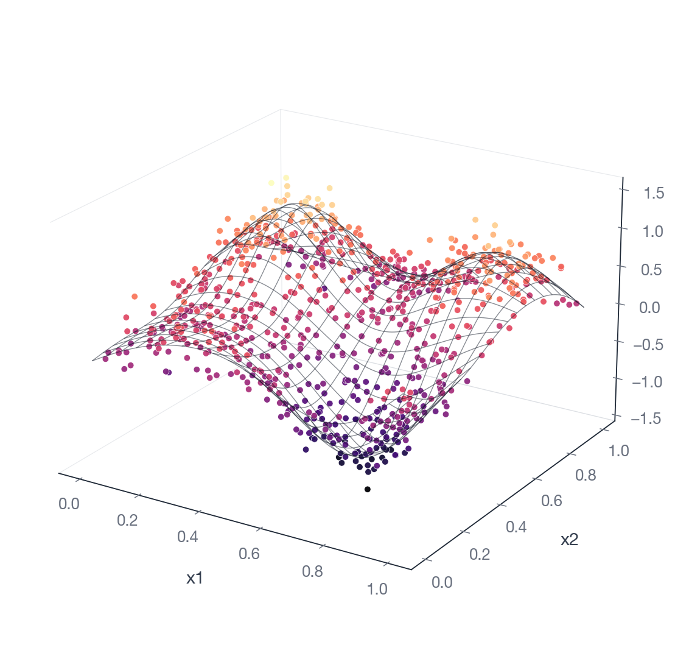

# Getting started

## Installation

Wheels are published for Linux (x86_64, aarch64), macOS (x86_64, Apple
silicon), and Windows. The prebuilt wheels do not require a Rust toolchain.

```bash
uv add gamfit
```

Or as a one-off without a project:

```bash
uv pip install gamfit
```

`pip install gamfit` works too. The wheel includes the Rust extension
(`gamfit._rust`).

### Optional extras

```bash
uv add "gamfit[pandas]"     # pandas + pyarrow input/output
uv add "gamfit[plot]"       # matplotlib-based plotting
uv add "gamfit[sklearn]"    # scikit-learn integration
uv add "gamfit[torch]"      # PyTorch bridge
uv add "gamfit[all]"        # everything
```

Plain `gamfit` works without any of these. Adding `pandas`/`pyarrow` only
changes what `predict()` returns (and accepts); the engine does not depend
on them. Without `matplotlib`, `Model.plot()` and posterior trace plots
raise. Without `scikit-learn`, `gamfit.sklearn` imports fail. Without
`torch`, `gamfit.torch` imports fail.

### Verifying the install

```python
import gamfit
print(gamfit.__version__)
print(gamfit.build_info())
```

`build_info()` returns a dict with `available: True` when the Rust
extension loaded. If `available: False`, get the diagnostic with
`gamfit.explain_error(...)`.

## Your first model

```python
import gamfit

train = [
    {"y": 1.2, "x": 0.0},
    {"y": 1.9, "x": 1.0},
    {"y": 3.1, "x": 2.0},
    {"y": 4.5, "x": 3.0},
    {"y": 5.0, "x": 4.0},
]

model = gamfit.fit(train, "y ~ s(x)")
print(model)
```

Three things happened:

1. **Family inferred.** `y` is continuous, so the family is Gaussian with
   identity link. Override with `family=` or `link=`.
2. **Smooth fit.** `s(x)` is a P-spline (cubic B-spline + difference penalty).
   The basis size is chosen automatically; pass `k=` to set it yourself.
3. **Smoothing parameter selected by REML.**

In two dimensions the same thing looks like this — raw observations as
points, the fitted smooth as a wireframe through them:



## Predict

```python
preds = model.predict([{"x": 1.5}, {"x": 2.5}])
```

Returns the linear predictor (`eta`) and the response-scale mean (`mean`),
in the same table format passed in. For credible intervals:

```python
preds = model.predict([{"x": 1.5}, {"x": 2.5}], interval=0.95)
# Columns: eta, mean, effective_se, mean_lower, mean_upper
```

See [predictions.md](predictions.md) for `return_type`, `id_column`, and
the `SurvivalPrediction` object.

## Inspect

```python
model.summary()                     # coefficients, deviance, REML score, etc.
model.diagnose(train).metrics       # n_obs, mae, rmse, bias, r_squared
model.check(test).ok                # schema check before predicting
model.plot(train, x="x")            # matplotlib (requires gamfit[plot])
model.report("out.html")            # standalone HTML report
```

See [diagnostics.md](diagnostics.md) for the full list.

## Persist

```python
model.save("model.gam")
loaded = gamfit.load("model.gam")
```

The `.gam` file is a binary blob that round-trips exactly. See
[persistence.md](persistence.md).

## Posterior sampling

Smoothing parameters are point estimates from REML. To draw from the
posterior of the coefficients conditional on those estimates:

```python
posterior = model.sample(train, seed=42)
print(posterior)
# PosteriorSamples(n_draws=..., n_coeffs=8, method='nuts',
#                  rhat=1.004, ess=..., converged=True)

bands = posterior.predict(test, level=0.95)
```

Defaults for `samples`, `warmup`, and `chains` are derived from the
coefficient count — see [posterior-sampling.md](posterior-sampling.md) for
the exact rule and how to override.

NUTS is used where possible. Gaussian Laplace is used for model classes
without exact NUTS support (location-scale survival, latent survival,
location-scale GLMs, transformation-normal, Bernoulli marginal-slope). See
[posterior-sampling.md](posterior-sampling.md).

## Where to go next

- Multiple smooths and constraints: [formulas.md](formulas.md) covers the
  full DSL.
- Classification, count, positive-continuous data, or non-default links:
  [families-and-links.md](families-and-links.md).
- Survival data: [survival.md](survival.md) and, if you have a risk score,
  [marginal-slope.md](marginal-slope.md).
- pandas / pipelines / cross-validation: [sklearn.md](sklearn.md).
- End-to-end recipes: [cookbook.md](cookbook.md).
