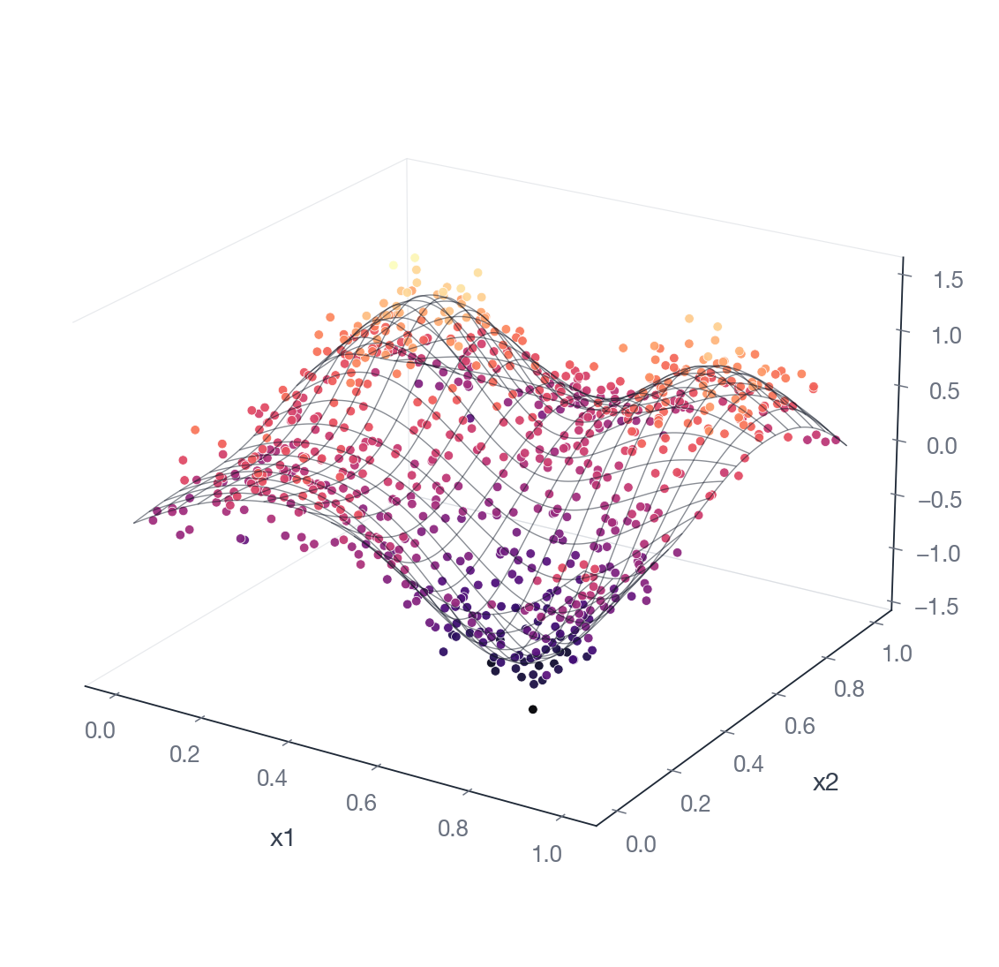

# Getting started

## Installation

Wheels are published for Linux (x86_64, aarch64), macOS (x86_64, Apple
silicon), and Windows. The wheels embed the Rust extension
(`gamfit._rust`); no Rust toolchain is required at install time.

```bash
uv add gamfit
```

One-off install without a project:

```bash
uv pip install gamfit
```

`pip install gamfit` also works.

### Optional extras

```bash
uv add "gamfit[pandas]"     # pandas input/output (pyarrow not required)
uv add "gamfit[plot]"       # matplotlib-based plotting
uv add "gamfit[sklearn]"    # scikit-learn integration
uv add "gamfit[cuda]"       # NVIDIA CUDA 12 wheel libraries on Linux x86_64
uv add "gamfit[all]"        # pandas + plot + sklearn extras
uv add torch                # PyTorch bridge dependency
```

`gamfit` runs without any extra. The extras only affect input/output
conversions and auxiliary modules: without `pandas`/`pyarrow`,
`predict()` returns the format you supplied; without `matplotlib`,
`Model.plot()` and posterior trace plots raise; without `scikit-learn`,
`gamfit.sklearn` fails to import; without the separate `torch` package,
`gamfit.torch` fails to import. `gamfit[cuda]` installs CUDA 12 runtime
libraries for Linux x86_64 environments that do not use a system CUDA
toolkit.

### Verifying the install

```python
import gamfit
print(gamfit.__version__)
print(gamfit.build_info())
```

`build_info()` returns a dict. `available: True` means the Rust
extension loaded. On `available: False`, inspect the `reason` field;
`gamfit.explain_error(exc)` gives hints for exceptions raised by
Rust-backed calls.

## First model

```python
import gamfit

train = [
    {"y": 1.2, "x": 0.0},
    {"y": 1.9, "x": 1.0},
    {"y": 3.1, "x": 2.0},
    {"y": 4.5, "x": 3.0},
    {"y": 5.0, "x": 4.0},
    {"y": 5.4, "x": 5.0},
    {"y": 5.6, "x": 6.0},
    {"y": 5.5, "x": 7.0},
    {"y": 5.2, "x": 8.0},
    {"y": 4.8, "x": 9.0},
    {"y": 4.4, "x": 10.0},
    {"y": 4.1, "x": 11.0},
]

model = gamfit.fit(train, "y ~ s(x)")
print(model)
```

`gamfit.fit(data, formula)` returns a `Model`. With `family="auto"` (the
default), the family is inferred from the response column. For a
continuous `y` this is Gaussian with the identity link. Override with
`family=` or `link=`.

`s(x)` is a cubic penalized B-spline (B-spline basis with an exact
integrated second-derivative roughness penalty).
The basis dimension is chosen from the data unless `k=` is set. The
smoothing parameter is selected by REML.

A 2-D smooth fit to scattered observations:



## Predict

```python
preds = model.predict([{"x": 1.5}, {"x": 2.5}])
```

For standard scalar models, `predict()` returns a 1-D NumPy array of
response-scale point predictions by default. Ask for a table with
`return_type=`, `id_column=`, or `interval=`.

For pointwise Wald intervals, pass `interval=`:

```python
preds = model.predict([{"x": 1.5}, {"x": 2.5}], interval=0.95)
# Columns: linear_predictor_plugin, mean_plugin, posterior_mean,
#          posterior_mean_standard_error, posterior_mean_lower, posterior_mean_upper
```

Transformation-normal and Bernoulli marginal-slope models follow the
same point-vector default; table form uses `z` for transformation-normal
and `mean` for marginal-slope probabilities. Survival models return a
`SurvivalPrediction` object with `.hazard_at(...)`, `.survival_at(...)`,
`.cumulative_hazard_at(...)`, chunk iterators, and CSV writers.

See [predictions.md](predictions.md) for details on `return_type`,
`id_column`, and `SurvivalPrediction`, and
[partial-effects.md](partial-effects.md) for per-term curves and their bands.

## Inspect

```python
model.summary()                     # Summary object
model.diagnose(train).metrics       # n_obs, mae, rmse, bias, optional r_squared
model.check(test).ok                # schema check against training
model.partial_dependence("s(x)")    # a term's curve with pointwise and simultaneous bands
model.plot_terms()                  # draw every term (requires gamfit[plot])
model.report("out.html")            # standalone HTML report
```

`Model.summary()` returns a `Summary` carrying the formula, family
name, model class, deviance, REML/LAML criterion (in the `reml_score`
field), per-coefficient estimates with optional standard errors,
smoothing parameters, covariance metadata, deployment extensions, and
group metadata. `reml_score` is `None` on an exactly-interpolating fit,
whose restricted likelihood is unbounded — see
[diagnostics.md](diagnostics.md).

See [diagnostics.md](diagnostics.md) for the full list.

## Persist

```python
model.save("model.gam")
loaded = gamfit.load("model.gam")
```

The `.gam` file is a binary blob; `save`/`load` round-trip exactly.
`Model.dumps()` and `gamfit.loads(bytes)` are the in-memory equivalents.
See [persistence.md](persistence.md).

## Posterior sampling

Smoothing parameters are point estimates from REML. To draw from the
posterior of the coefficients conditional on those estimates:

```python
posterior = model.sample(train, seed=42)
print(posterior)
# PosteriorSamples(n_draws=..., n_coeffs=8, method='nuts',
#                  rhat=1.0040, ess=..., converged=True)

bands = posterior.predict(test, level=0.95)
```

The default for `samples` is derived from the coefficient count. Warmup
has no fixed length: it ends once the two chains have converged. See
[posterior-sampling.md](posterior-sampling.md) for both rules.

NUTS is used for most exact sampling paths; Bernoulli-logit standard
GLMs use the Polya-Gamma Gibbs path. Gaussian Laplace is used for
classes without an exact NUTS path (latent, latent-binary, and
location-scale survival, location-scale GLMs, transformation-normal,
Bernoulli marginal-slope).

## Next

- Multiple smooths and constraints: [formulas.md](formulas.md).
- Classification, count, positive-continuous data, or non-default links:
  [families-and-links.md](families-and-links.md).
- Survival data: [survival.md](survival.md); marginal-slope models:
  [marginal-slope.md](marginal-slope.md).
- pandas / pipelines / cross-validation: [sklearn.md](sklearn.md).
- Worked examples: [cookbook.md](cookbook.md).
