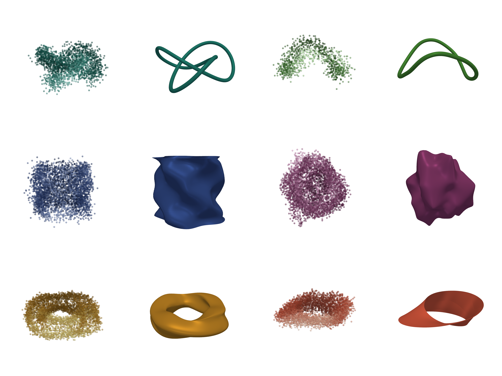

# Manifold and geometric smooths

`gamfit` ships a family of smooths whose **predictor space is a manifold
other than flat Euclidean ℝᵈ**: a circle, a cylinder, a torus, a sphere,
or a one-sided strip. Each one is exposed through the formula DSL with no
new arguments to `fit()` — you describe the manifold in the formula and
the engine picks the right basis and penalty automatically.

This page is the visual tour. The full reference for the underlying
formula options lives in the [Formula DSL reference](formulas.md).

## Recovering six manifolds from noisy point clouds

The image below is the output of
[`scripts/geometric_shapes_demo.py`](https://github.com/SauersML/gam/blob/main/scripts/geometric_shapes_demo.py).
For each of six manifolds, we sample noisy 3-D points
`(x, y, z)` along the manifold and fit **one geometric smooth per
output coordinate**:

```python
gamfit.fit(df, "x ~ <geometric-smooth>(latent_params)")
gamfit.fit(df, "y ~ <geometric-smooth>(latent_params)")
gamfit.fit(df, "z ~ <geometric-smooth>(latent_params)")
```

Predicting all three coordinates on a dense grid in the latent space and
stitching them together gives the recovered shape. Left panel of each
pair: noisy observations (color encodes camera-relative depth). Right
panel: the smooth manifold the fits recover.

{ width="100%" }

The same shapes, rendered higher-resolution as a static still:

{ width="100%" }

A slower MP4 (first half of the loop, played at 2/3 speed) for
closer inspection:

<video controls autoplay loop muted playsinline width="100%">
  <source src="../images/geometric_shapes_demo_slow.mp4" type="video/mp4">
</video>

The script regenerates a full-length, full-speed MP4 alongside the
GIF and PNG — run the [reproduction recipe](#reproducing-the-demo)
below to get it locally. Source browsers can also open
[the MP4 asset](images/geometric_shapes_demo_slow.mp4) directly.

## The six shapes and the formulas behind them

| Shape | Latent params | Formula used in the demo |
| --- | --- | --- |
| **Trefoil knot** (closed curve in ℝ³) | `t` ∈ [0, 2π) | `x ~ s(t, periodic=true, period=2*pi, k=24)` |
| **Latent-free loop** (closed curve, `t` inferred from the points themselves via PCA + atan2) | inferred `t` ∈ [0, 2π) | `x ~ s(t, periodic=true, period=2*pi, k=18)` |
| **Wobbly cylinder** (one periodic axis, one open axis) | `θ` ∈ [0, 2π), `h` ∈ [0, 1] | `x ~ te(theta, h, periodic=[0], period=[2*pi, None], k=[26,12])` |
| **Lumpy sphere** (intrinsic S² with multiple bulges + a deep crater) | `lat`, `lon` (radians) | `x ~ sphere(lat, lon, radians=true, k=100)` |
| **Bumpy torus** (two periodic axes, period 2π in each) | `u`, `v` ∈ [0, 2π) | `x ~ te(u, v, periodic=[0,1], period=[2*pi, 2*pi], k=[20,16])` |
| **Möbius embedding (4π double-cover)** — the smoother sees an orientable cylinder `S¹ × [−v,v]` with period **4π** in `u`; the embedding in ℝ³ happens to trace out a Möbius strip because `F(u+2π,v) = F(u,−v)` in the data. The smoother does *not* enforce the twisted identification `(u,v) ∼ (u+2π,−v)`. | `u` ∈ [0, 4π), `v` ∈ [−0.8, 0.8] | `x ~ te(u, v, periodic=[0], period=[4*pi, None], k=[32,10])` |

The three coordinate fits per shape are independent — there is no shared
parameter and no joint loss. The fact that the reassembled surfaces are
seam-continuous and singularity-free is entirely a property of the basis
+ penalty choice on the latent manifold.

### Notes on the harder cases

- **Latent-free loop.** When the latent parameter is not observed, the
  demo estimates `t` from the noisy points via the angle of the first
  two principal components — no special API, just preprocessing. The
  cyclic boundary removes the seam, but the chosen parameterisation still
  sets the metric used by the spline basis and penalty.
- **Sphere.** The intrinsic `sphere(lat, lon)` smooth uses Wahba's
  reproducing kernel on S², which is rotation-invariant and free of
  pole artefacts. A spherical-harmonic alternative is also available
  (`method=harmonic, max_degree=L`); both are documented in
  [the formula reference](formulas.md#intrinsic-s2-sphere-smooth).
- **Möbius strip.** The half-twist means you have to go around twice
  before returning to the start, so the period of `u` is `4π`, not
  `2π`. The fitter does not know the strip is non-orientable — it only
  knows that the marginal in `u` wraps with period `4π` — and the
  recovered embedding happens to be Möbius because the input points are.

## Why use a geometric smooth over an ordinary smooth?

If you fit `te(theta, h)` on a cylinder without `periodic=[0]`, the
recovered surface will have a visible seam at `θ = 0`. Same for a torus
(two seams) or sphere (a longitude seam, plus pole crowding). The
geometric smooths bake the wrap topology into both the basis and the
penalty so:

- Predictions at `θ = 0` and `θ = 2π` agree; values near the seam vary
  continuously around the loop.
- The penalty integrates the squared derivative *around* the loop, not
  just over the observed sample, so the wiggliness budget is spent
  honestly.
- For the sphere, isotropy means the same kernel applies near the poles
  as at the equator — no special handling required.

## Reproducing the demo

Build the release binary, then run the script:

```bash
cargo build --release
uv run --with numpy --with pyvista --with matplotlib \
       --with imageio --with imageio-ffmpeg --with pillow \
       python3 scripts/geometric_shapes_demo.py
```

The first run generates noisy CSVs under
`scripts/geometric_shapes_demo_data/`, fits 18 small models via the
`gam` CLI (≈ 15 s on a laptop), and writes PNG + MP4 + GIF outputs
alongside the script. Re-runs reuse the cache; pass `--regen` to start
fresh, or `--still / --mp4 / --gif` to render only one output.

For a smaller, Python-only entry point — a single tilted 3-D circle
with a localized radial spike, fit via `gamfit.fit` directly without
the CLI — see [`scripts/circle_3d_cyclic_demo.py`](https://github.com/SauersML/gam/blob/main/scripts/circle_3d_cyclic_demo.py)
(120 lines, no PyVista, no rendering dependencies beyond matplotlib).

## Related reading

- [Formula DSL — periodic / cyclic smooths](formulas.md#periodic-cyclic-smooths)
- [Formula DSL — boundary-conditioned 1-D smooths](formulas.md#boundary-conditioned-1d-smooths)
- [Formula DSL — intrinsic S² (sphere) smooth](formulas.md#intrinsic-s2-sphere-smooth)
- [Response geometry](response-geometry.md) — the **response-side**
  manifold story (compositional and unit-sphere outputs), which is a
  different concept: there the response lives on a manifold and the
  predictors are ordinary; here the predictors live on a manifold and
  the response is ordinary.
