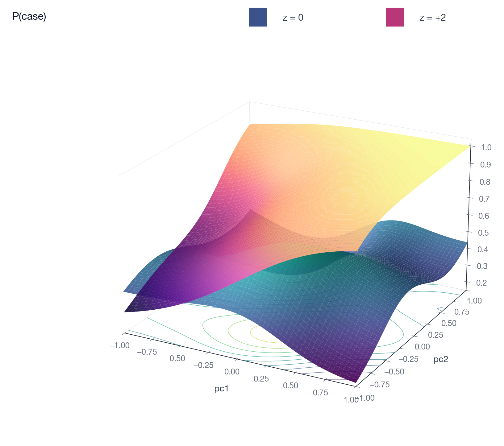

# Marginal-slope models

A marginal-slope model fits a standardised risk score `z` whose effect on
the outcome varies across covariate space. The baseline risk surface and
the score's slope surface live in two separate formulas, so the
baseline does not absorb score-specific signal and vice versa.



The vertical gap between the two probability surfaces is the risk
difference for a unit contrast in `z`. The modelled score effect lives on
the probit/slope scale and varies smoothly with covariates.

Two families:

- Bernoulli marginal-slope for binary outcomes. In Python, pass
  `family="bernoulli-marginal-slope"` with `slope_formula=`; in the
  CLI, `--z-column` and `--slope-formula` route to this fit.
- Survival marginal-slope (`survival_likelihood="marginal-slope"`) for
  time-to-event outcomes.

Both are identified around a latent `z` scale that should be approximately
`N(0, 1)` conditional on the covariates. Pass
`transformation_normal_stage1=gamfit.CtnStage1(...)` to condition the score
on covariates inside the fit (the calibrated chain below), or a raw
`z_column=` when the score is already conditionally `N(0, 1)` from outside
this pipeline.

## When to use it

You have:

1. A binary or time-to-event outcome.
2. A continuous risk score that is, or can be made, conditionally
   `N(0, 1)`.
3. Reason to believe the score's effect size varies across covariates
   (e.g. across age, grouping PCs).

A single-coefficient logistic or Cox fit on `outcome ~ score + ...`
forces one slope on the score. Marginal-slope makes the slope itself a
smooth function of covariates while leaving the baseline as a separate
smooth.

## Calibrated marginal slope (CTN-conditioned score)

When the score must be conditioned on covariates to reach the latent
`N(0, 1)` scale, supply a Stage-1 transformation-normal recipe with
`transformation_normal_stage1=`. This is the single calibrated
marginal-slope entry: it fits the conditional transformation
`h(score | covariates) ~ N(0, 1)` in each fold's training complement. An
ordinary penalized marginal-slope outcome uses those OOF scores, with no
influence absorber or second normalization. A separate full-training CTN is
saved together with the outcome in `CtnMarginalSlopeModel`. Prediction replays
that frozen transform on raw scores. Cross-fitting alone establishes neither
Neyman orthogonality nor outcome calibration.

Supply explicit fold labels or a group column. Group assignment is seeded and
independent of row order; supplied folds are checked for group separation when
both columns are present. All fitting data must belong to the outer training
sample. Fold-local knots and geometry never use the outer test sample.

```python
model = gamfit.fit(
    df,
    "case ~ s(age) + matern(pc1, pc2, pc3)",
    family="bernoulli-marginal-slope",
    slope_formula="matern(pc1, pc2, pc3)",
    transformation_normal_stage1=gamfit.CtnStage1(
        response="raw_score",
        covariates="duchon(pc1, pc2, pc3, pc4, centers=20)",
        group_column="family_id", folds=2, seed=20260910,
    ),
    scale_dimensions=True,
)

probs = model.predict(test_df)
model.save("predictor.gamfit")
probs_reloaded = gamfit.load("predictor.gamfit").predict(test_df)
```

By default, Bernoulli marginal-slope prediction returns a 1-D NumPy
array of probabilities. Passing `return_type=` asks for a table. Passing
`interval=0.95` asks for the interval table with `linear_predictor`,
`mean`, `std_error`, `mean_lower`, and `mean_upper`; probability-scale
values are clipped to `[0, 1]`. `std_error` is the probability-scale
posterior standard error (the same response-scale quantity every class's
`std_error` / `posterior_mean_standard_error` column carries); the bounds
are the inverse probit of the η-scale endpoints `η ± z·se_η`, so they are
symmetric about `linear_predictor` on the link scale.

- `family="bernoulli-marginal-slope"` names the likelihood;
  `slope_formula=` is the slope surface as a function of covariates.
- `transformation_normal_stage1=gamfit.CtnStage1(response=..., covariates=...)`
  is the Stage-1 recipe: `response` is the raw score column to condition,
  `covariates` is the covariate-side formula right-hand side used to fit
  `h(score | covariates) ~ N(0, 1)`. `fold_column` supplies explicit labels;
  `group_column` assigns entire families together. Failed folds raise an error.
- Saved `transform` and `outcome` components are available for manual replay.
  Outcome intervals are conditional on the fitted CTN, not full two-stage
  uncertainty estimates. The experimental Rust influence path is separate
  from this Python prediction API.
- The base link is fixed to probit. The Python `link=` keyword is not
  needed for marginal-slope fits.

The main formula controls the baseline risk; `slope_formula` controls
the strength of the score effect at each point in covariate space.

The same recipe drives the survival likelihood:

For prospective net survival, the saved chain also exposes
`model.survival_at(baseline_df, [1., 3., 5.])`. It supplies the requested
times and zero event indicators internally, without reading observed outcome
times. `entry_time=a0` conditions the curve on a common event-free entry time;
use absolute times `a0 + horizon` in that case. Competing-risk incidence needs
separate cause components and a CIF, not one minus disease-only net survival.

```python
model = gamfit.fit(
    df,
    "Surv(entry, exit, event) ~ s(bmi) + s(hba1c)",
    survival_likelihood="marginal-slope",
    slope_formula="s(bmi) + s(hba1c)",
    transformation_normal_stage1=gamfit.CtnStage1(
        response="raw_score",
        covariates="s(bmi) + s(hba1c)",
        group_column="family_id", folds=2,
    ),
)

pred = model.predict(test_df)
S = pred.survival_at([1, 5, 10])
```

The main formula specifies the baseline survival surface; the score's
slope on the marginal-calibrated probit survival scale is a smooth
function of covariates given by `slope_formula`. In the Python API,
omitting `slope_formula` reuses the main covariate formula for the
slope surface.

### A note on the name: `slope_formula` is the SLOPE surface

The block used to be called `logslope`; the map is the identity. `slope_formula=`
gives the surface `b(x)` that the latent score enters the probit index
with directly, not its logarithm, and that is deliberate rather than an
oversight:

- **The slope is signed.** `b(x) < 0` is a score that is protective at
  that point in covariate space, and with several scores each carries its
  own sign. A genuine log link `b = exp(g)` cannot express either. Where
  the surface crosses zero is not a pathology; it is the covariate value
  at which the score stops predicting.
- **A log penalty would not change the fit, only `λ`'s units.** Rescaling
  the score `z → z/κ` sends `b → κb` and the score covariance
  `Σ → Σ/κ²`, and the index `η` and the preserving scale `c` are
  *pointwise* unchanged under that — measured, in
  `survival_multi_z_slope_scale_equivariance_2764`. What is left is the
  penalty `λβᵀSβ`, which needs `λ → λ/κ²` to match, and REML supplies
  exactly that on its own: its criterion shifts by a constant in `λ` under
  the reparameterisation, so `λ̂` moves and the fitted surface does not. A
  penalty on `log b` would additionally pin the numeric value of `λ̂`; that
  is a statement about units, and it would cost the sign.

The keyword, the CLI flag and the saved-model fields were renamed to `slope`
as a deliberately breaking change: no `logslope` alias or persisted fallback
is retained, so a model saved under the old field names is not read as a
slope model and must be refitted. Inside the library the function that states
the map is called `rigid_observed_slope`, because that is what it computes.

## Letting the slope vary along follow-up (survival)

`slope_formula` makes the slope a surface in *covariates*. On the survival
likelihood it can also be a surface in *follow-up time*, which is the natural
question for a score whose effect is thought to attenuate with age:

```python
model = gamfit.fit(
    df,
    "Surv(entry, exit, event) ~ s(bmi)",
    survival_likelihood="marginal-slope",
    z_column="z",
    slope_formula="s(bmi)",
    config={"slope_time_k": 6},   # B-spline margin in log(time)
)
```

`slope_time_k` tensors the slope covariate design against a B-spline
margin in `log t`, exactly as `threshold_time_k` and `sigma_time_k` do for the
location-scale family, so `b` becomes a fitted surface `b(x, t)` with
independent smoothing parameters for the covariate and time directions.
`slope_time_degree` (default `3`) sets the margin's polynomial degree; the
same `k >= degree + 1` rule applies. The CLI spelling is `--slope-time-k` /
`--slope-time-degree`.

Why this needs family support rather than data reshaping: the marginal-slope
likelihood is a *transformation* model, `S(t | x, z) = Φ(−η(t))`, not a hazard
model. Splitting each subject into intervals with a piecewise-constant slope —
the usual Cox `tt()` workaround — gives per-row contributions
`log S(t₁) − log S(t₀)` that do not telescope into any survival function. The
slope has to move inside the row likelihood, which also means the event density
picks up the two terms a constant slope zeroes out:

```
η′(t) = q′(t)·c(t) + q(t)·c′(t) + b′(t)·z
```

Current boundaries, all of which are refused with a message rather than
silently reinterpreted:

- a per-score slope topology (a vector latent score with one slope surface
  per coordinate) cannot take a single time margin;
- a non-zero smooth anchor, coefficient bounds, or linear constraints on the
  slope surface are stated in the covariate coordinate chart, and the time
  tensor product is a different chart.

Saving and prediction carry the margin. The resolved knots ride on the saved
model next to the threshold and log-σ margins, and predict rebuilds the block as
`X_cov ⊗ᵣ B(log t)` against *those* knots, so a prediction sample can never move
the basis by re-estimating quantiles. Two consequences worth stating, because
they are what makes the replay faithful rather than merely well-typed:

- a predicted survival curve evaluates `b(t)` **at each time on the curve**, not
  at the row's observed exit time. `S(t) = Φ(−η(t))` with `η(t) = q(t)c(t) +
  b(t)z`, so freezing `b` at the exit time would return a different model at
  every point of the curve but one;
- the leave-one-out (`--alo`) replay rebuilds all three follow-up channels —
  entry, exit, and exit-rate — because that is what the row program reads. With
  only the exit channel it would report the influence of a time-constant slope.

## Externally calibrated score (raw `z_column`)

If the score is already conditionally `N(0, 1)` — for example a
standardised score produced outside this pipeline — pass it directly with
`z_column=` and omit the Stage-1 recipe. This raw-`z` path uses the
free-warp `score_warp` fallback for shape miscalibration, and the
automatic latent-measure gate described below for conditional
miscalibration. Use `config={"frozen_score": True}` when an external
transformation already supplies the declared conditional standard-normal
measure and must not be normalized again. This asserts a score-distribution
assumption; it does not prove it. Prefer the CTN chain when the fitted
transformation should travel with the outcome predictor.

```python
model = gamfit.fit(
    df,
    "case ~ s(age) + matern(pc1, pc2, pc3)",
    family="bernoulli-marginal-slope",
    z_column="z",
    slope_formula="matern(pc1, pc2, pc3)",
    scale_dimensions=True,
)
```

- `z_column="z"`: name of the conditional z-score column in both the
  training and prediction tables.

CLI equivalent:

```bash
gam fit data.csv 'case ~ s(age) + matern(pc1, pc2, pc3)' \
    --slope-formula 'matern(pc1, pc2, pc3)' --z-column z \
    --scale-dimensions --out model.gam
```

Bernoulli marginal-slope currently consumes a single `z_column`.

### The automatic latent-measure gate

You do not have to get the raw score exactly right. Both marginal-slope
families run an automatic gate on the score before it reaches the kernel,
and both run the same one.

The gate matters because the parameterisation's whole point is an
identity that is *conditional*:

```text
E_z[Φ(q·√(1+b²) + b·z)] = Φ(q)        for   z | C ~ N(0, 1),
```

which is what makes `q` the **marginal** index. It needs `z | C` standard
normal, not merely `z` standard normal — and those are very different
requirements. A score can be exactly `N(0, 1)` overall while every
conditional law `z | C` is shifted, in which case `b(C)·E[z|C]` leaks into
`q` and the marginal coefficients are wrong. No transform of the score's
*marginal* distribution can fix that, because the marginal distribution is
already correct.

So the gate looks at the conditional moments first:

1. a Rao score test on `E[z|C]` and `Var(z|C)` over the marginal-index
   span. If it fires, the score is replaced by
   `ζ = (z − m(C))/√v(C)`, which is conditionally centred and at unit
   variance by construction;
2. otherwise, a standard-normal adequacy check on the pooled score;
3. otherwise, a weighted mid-rank inverse-normal transform, re-checked on
   its own output.

Whatever it decides is **persisted with the model** and replayed at
prediction and in leave-one-out diagnostics, because the fitted
coefficients live on the calibrated axis: a predictor that rebuilt the
score differently would be evaluating a different model.

Two family differences are worth knowing. The Bernoulli kernel owns an
empirical-grid branch, so when no transform makes the score adequately
normal it falls back to the exact empirical latent measure. The survival
kernel is the closed-form standard-normal probit lowering and has no such
branch, so it keeps the closest available transform and *says* — through
the fit's `LatentZCheckMode` — that the residual shape is unmodelled.
And when the conditional branch fires, the score becomes a generated
regressor: the coefficient covariance carries a Murphy–Topel correction
for the first stage's estimation error, or is withheld with a typed reason
if the fit's shape cannot supply the correction. It is never published
uncorrected.

### Several scores at once, and the covariance between them

The survival family accepts more than one latent score — one `z(...)`
surface per score in `slope_formula=`, each with its own slope
surface. With `K` scores the row index is

```text
η = c(a)·q(t, a) + Σ_k r_k(a)·z_k ,
```

and the identity above generalises to

```text
E_z[Φ(−η) | a] = Φ(−q(t, a))     ⟺     c(a) = √(1 + r(a)ᵀ Σ(a) r(a)) ,
```

with `Σ(a) = Var(z | a)` the **conditional** covariance of the score
vector. Only the diagonal of that is reachable by the per-coordinate gate
above: it standardises each `z_k` given `C`, which forces
`Var(z_k | a) = 1`, and leaves `Cov(z_j, z_k | a)` untouched. Two scores
can each be conditionally standard normal while their correlation moves
across the covariate space — different ancestries, different genotyping
arrays, different assay batches all do this — and then one pooled `Σ̄`
gives the wrong `c` at every row. The consequence is not subtle: the
realised marginal index becomes `q·c̄/c(a)`, so every marginal coefficient
is multiplied by a covariate-dependent factor. Measured on a two-score
sample whose conditional correlation moves over `±0.8`, that factor
reaches **1.46**.

So the fit tests for it. One robust Rao score test per score pair, on the
same conditioning span and at the same level as the gate above, asks
whether `Cov(z_j, z_k | a)` is constant. If no pair says otherwise, the
pooled covariance is used unchanged. If one does, the fit estimates
`Σ(a)` and every row gets its own `c(a)`.

The estimated object is a **modified Cholesky** regression —
`T(a)Σ(a)T(a)ᵀ = D(a)`, with `T` unit lower triangular and `log D(a)`
linear in the conditioning span. That parameterisation is unconstrained,
so `Σ(a)` is positive definite at every `a` including rows far outside
the training data; each fitted linear predictor is additionally held to
the range it took over the training rows, because a linear predictor is
only identified on the range the sample explored.

Those predictors are **linear in the conditioning span**, which is the
marginal design. So the model removes the part of the covariance's
variation that the marginal design can express, and no more — if the
correlation moves smoothly with a covariate, put a smooth of that
covariate in the marginal formula and the span will carry it. A bare
linear column leaves a real residual when the truth is curved, and that
residual grows with the slope rather than sitting at the noise floor.

Two limits are worth stating plainly:

- **`K = 1` is unaffected.** There is no off-diagonal, and `Var(z | a)` is
  already the per-coordinate gate's business. A single-score fit is
  bit-for-bit what it was.
- **A fit that used a conditional `Σ(a)` cannot be saved yet.** It needs
  `K ≥ 2`, and the saved-model contract carries one score column and one
  score covariance. Saving is refused at the point of loss with the reason
  attached, rather than failing later as a shape mismatch on load.

## Fixed external baseline (slope-only fit)

Both marginal-slope families route the two offset columns onto their two
predictors: `offset=` is added to the marginal (baseline) predictor and
`noise_offset=` to the slope predictor. Under `bernoulli-marginal-slope`
the marginal predictor is the probit index of the marginal prevalence, so
a baseline known from outside the data — a published prevalence
`prev(x)` — enters as `Φ⁻¹(prev)` in an offset column against an
intercept-only marginal formula, leaving the slope surface free:

```python
from scipy.stats import norm

df["baseline"] = norm.ppf(df["prev"])
model = gamfit.fit(
    df,
    "case ~ 1",
    family="bernoulli-marginal-slope",
    z_column="z",
    slope_formula="s(x)",
    offset="baseline",
)
```

The intercept absorbs any constant miscalibration of the external
baseline. `noise_offset=` plays the same role on the slope side: a known
slope component held fixed while the rest of `slope_formula=` is
estimated. Under `survival-marginal-slope` the same two columns offset the
threshold predictor and the slope predictor respectively. CLI equivalents
are `--offset-column` and `--noise-offset-column`.

## Frailty in marginal-slope survival

Survival marginal-slope supports no frailty, or
`frailty_kind="gaussian-shift"` with a fixed `frailty_sd`.
`"hazard-multiplier"` and a learnable gaussian-shift sigma are rejected
at fit time.

```python
gamfit.fit(df,
    "Surv(entry, exit, event) ~ s(age)",
    survival_likelihood="marginal-slope",
    slope_formula="s(age)",
    transformation_normal_stage1=gamfit.CtnStage1(
        response="raw_score", covariates="s(age)",
        group_column="family_id", folds=2,
    ),
    frailty_kind="gaussian-shift",
    frailty_sd=0.3,
)
```

## Detecting marginal-slope models after loading

```python
model = gamfit.load("model.gam")
model.is_marginal_slope            # True if a marginal-slope family
model.is_survival                  # True if survival
model.is_transformation_normal     # True if a Stage 1 calibration model
model.model_class                  # full class string
```

## Notes

- Supply `transformation_normal_stage1=` to condition the score on
  covariates inside the fit (the calibrated chain). Use a raw `z_column=`
  only for a score already conditionally `N(0, 1)` from outside this
  pipeline.
- Set `scale_dimensions=True` when calibrating on a handful of PCs so
  anisotropic length scales are learned per axis.
- Posterior sampling: Bernoulli marginal-slope and transformation-normal
  models use the Gaussian Laplace approximation in `Model.sample(...)`;
  survival marginal-slope uses NUTS over the joint coefficient vector.
  See [posterior-sampling.md](posterior-sampling.md).
- Predict output: Bernoulli marginal-slope returns a 1-D probability
  array by default. Pass `id_column=` or `return_type="dict"` for a
  table. The same applies to transformation-normal models.

## End-to-end example

```python
import gamfit
import numpy as np
import pandas as pd

n = 1000
rng = np.random.default_rng(0)
df = pd.DataFrame({
    "PGS":  rng.normal(0, 1, n) + 0.3 * rng.normal(0, 1, n),
    "pc1":  rng.normal(0, 1, n),
    "pc2":  rng.normal(0, 1, n),
    "pc3":  rng.normal(0, 1, n),
})
df["disease"] = (rng.uniform(0, 1, n) < 0.25).astype(float)
df["family_id"] = np.arange(n)  # This illustrative sample is unrelated.

# Condition the score on the PCs and fit the slope surface in one
# cross-fitted predictive call.
model = gamfit.fit(
    df,
    "disease ~ matern(pc1, pc2, pc3, centers=20)",
    family="bernoulli-marginal-slope",
    slope_formula="matern(pc1, pc2, pc3, centers=20)",
    transformation_normal_stage1=gamfit.CtnStage1(
        response="PGS",
        covariates="matern(pc1, pc2, pc3, centers=20)",
        group_column="family_id", folds=2,
    ),
    scale_dimensions=True,
)

test = df.head(50).copy()
probs = model.predict(test)
```
