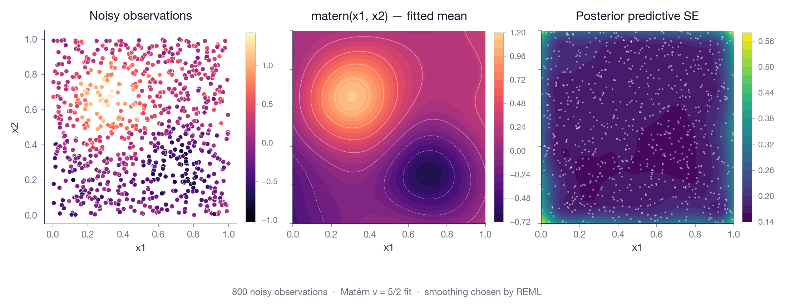

# Predictions

`Model.predict(...)` is the single predict entry point. The shape of its
return value depends on the fitted model class and on a few
kwargs (`interval`, `id_column`, `return_type`, `with_uncertainty`).

## Signature

```python
model.predict(
    data,
    *,
    interval: float | None = None,
    return_type: str | None = None,
    id_column: str | None = None,
    with_uncertainty: bool = False,
)
```

| Kwarg | Default | Meaning |
| --- | --- | --- |
| `interval` | `None` | Pointwise Wald interval level in `(0, 1)`, e.g. `0.95`. Honoured by standard GLM families (Gaussian, binomial, Poisson, Gamma) and Gaussian / binomial location-scale; ignored for survival (use `with_uncertainty=`), transformation-normal, and marginal-slope. |
| `return_type` | `None` | `"dict"`, `"numpy"`, `"pandas"`, `"polars"`, `"pyarrow"`, or `None` (infer from input or training kind). |
| `id_column` | `None` | Name of a column in `data` to preserve in the output. |
| `with_uncertainty` | `False` | Survival models: delta-method SEs on the survival surface and linear predictor. |

## Return value by model class

| Model class | Default return | Columns / fields |
| --- | --- | --- |
| **Standard** (Gaussian, binomial, Poisson, Gamma) | Table | `eta`, `mean` (+ `effective_se`, `mean_lower`, `mean_upper` if `interval`). |
| **Gaussian / binomial location-scale** | Table | `eta`, `mean` (+ `effective_se`, `mean_lower`, `mean_upper` if `interval`). |
| **Transformation-normal** | 1-D `numpy.ndarray` | Per-row conditional z-scores. |
| **Bernoulli marginal-slope** | 1-D `numpy.ndarray` | Per-row probabilities in `(0, 1)`. |
| **Survival** (any mode) | `SurvivalPrediction` | Object with `hazard_at`, `survival_at`, `cumulative_hazard_at`, `failure_at`. |

For the 1-D-array classes (transformation-normal, Bernoulli marginal-slope),
passing `id_column=` or `return_type=` flips the output back to a
two-column table — see [data-input.md](data-input.md#numpy-gotcha-transformation-normal-marginal-slope).

## Wald intervals on standard models

```python
preds = model.predict(test_df, interval=0.95)
# Columns: eta, mean, effective_se, mean_lower, mean_upper
```

These intervals come from the asymptotic frequentist covariance of the
fitted coefficients propagated through the link function. For posterior
credible bands conditional on the fitted smoothing parameters, use
[posterior sampling](posterior-sampling.md).

For a multi-D smooth, calling `predict(interval=0.95)` gives you both the
fitted mean and a pointwise SE for the fitted mean; the SE is largest where the
covariates are sparse:



## Passing through an identifier column

```python
preds = model.predict(
    [
        {"patient_id": "P001", "x": 1.5},
        {"patient_id": "P002", "x": 2.5},
    ],
    id_column="patient_id",
    return_type="dict",
)
# preds = {"patient_id": ["P001", "P002"], "eta": [...], "mean": [...]}
```

The id column isn't used by the model and can be of any type. It's
preserved verbatim in the output.

## SurvivalPrediction

For any survival model, `predict()` returns a `SurvivalPrediction`.
It exposes the fitted hazard surface on demand:

```python
pred = model.predict(test_df)

S   = pred.survival_at([1, 5, 10, 20])         # (n, 4) survival probs
F   = pred.failure_at([10, 20])                # 1 - S
h   = pred.hazard_at([1, 5, 10, 20])           # hazard rate
H   = pred.cumulative_hazard_at([10, 20])      # cumulative hazard
```

### Attributes

| Attribute | Type | Meaning |
| --- | --- | --- |
| `model_class` | `str` | E.g. `"survival marginal-slope"`. |
| `parameters` | `numpy.ndarray` | `(n, p)` per-row params. Opaque — use the `*_at` helpers. |
| `parameter_names` | `tuple[str, ...]` | Column names of `parameters`. |
| `times` | `numpy.ndarray \| None` | Shared time grid (if a dense surface was returned). |
| `hazard`, `survival`, `cumulative_hazard` | `numpy.ndarray \| None` | Dense surfaces if available. |
| `linear_predictor` | `numpy.ndarray \| None` | `η` at each row's exit time. |
| `survival_se`, `eta_se` | `numpy.ndarray \| None` | Delta-method SEs when `with_uncertainty=True`. |
| `id_column`, `row_ids` | `str \| None`, `tuple[Any, ...] \| None` | Set if `id_column=` was passed. |

### Methods

```python
pred.hazard_at(times)              # (n_rows, len(times))
pred.survival_at(times)            # (n_rows, len(times))
pred.cumulative_hazard_at(times)   # (n_rows, len(times))
pred.failure_at(times)             # 1 - survival_at(times)
pred.survival_se_at(times)         # SE on survival; None if not computed
```

### Chunked iteration for large cohorts

When `n_rows × len(times)` is too large to hold in memory, iterate in
chunks:

```python
for row_slice, time_slice, block in pred.survival_at_chunks(
    times=[1, 5, 10, 20, 50, 100],
    people_chunk=50_000,
    time_grid_chunk=64,
):
    process(block)  # shape (len(row_slice), len(time_slice))
```

Equivalent iterators: `hazard_at_chunks`, `cumulative_hazard_at_chunks`.

### Stream to CSV

```python
pred.write_survival_at_csv("surv.csv", times=[1, 5, 10, 20])
```

The CSV has columns `row, time, survival` (plus the id column if you set
`id_column=` on `predict`).

### Competing-risk CIF assembly

Fit or predict one cause-specific survival endpoint per event type, then
assemble Aalen-Johansen cumulative incidence functions on a shared grid:

```python
cif = gamfit.competing_risks_cif(
    {"disease": disease_pred, "death": death_pred},
    times=[1, 5, 10, 20],
)

disease_cif = cif.cif[0]              # (n_rows, 4)
joint_survival = cif.overall_survival # (n_rows, 4)
```

`cif.cif` has shape `(n_endpoints, n_rows, n_times)`. Endpoint names are
preserved from a mapping input or can be supplied with `endpoint_names=`.

### Survival uncertainty

For location-scale survival models, pass `with_uncertainty=True` to compute
delta-method standard errors on the survival surface and on the linear
predictor at each row's exit time:

```python
pred  = model.predict(test_df, with_uncertainty=True)
S     = pred.survival_at([1, 5, 10])
se_S  = pred.survival_se_at([1, 5, 10])

upper = (S + 1.96 * se_S).clip(0.0, 1.0)
lower = (S - 1.96 * se_S).clip(0.0, 1.0)
```

For other survival modes (transformation, Weibull, marginal-slope, latent),
`Model.sample(...)` returns posterior coefficient draws, but
`PosteriorSamples.predict_draws(...)` is restricted to standard
non-link-wiggle GAMs. See [posterior-sampling.md](posterior-sampling.md).

## Getting the raw design matrix

For non-link-wiggle standard GAMs, `Model.design_matrix(data)` returns the
materialised `(n_rows, n_coeffs)` matrix the engine uses internally for
the linear predictor:

```python
X = model.design_matrix(test_df)        # (n_rows, n_coeffs)
posterior = model.sample(train_df)
custom_eta = posterior.samples @ X.T    # (n_draws, n_rows)
```

Use this to compose your own posterior quantity that
isn't a straightforward `predict()` call. Restricted to standard
non-link-wiggle GAMs.

* [Difference smooths](difference-smooths.md)
